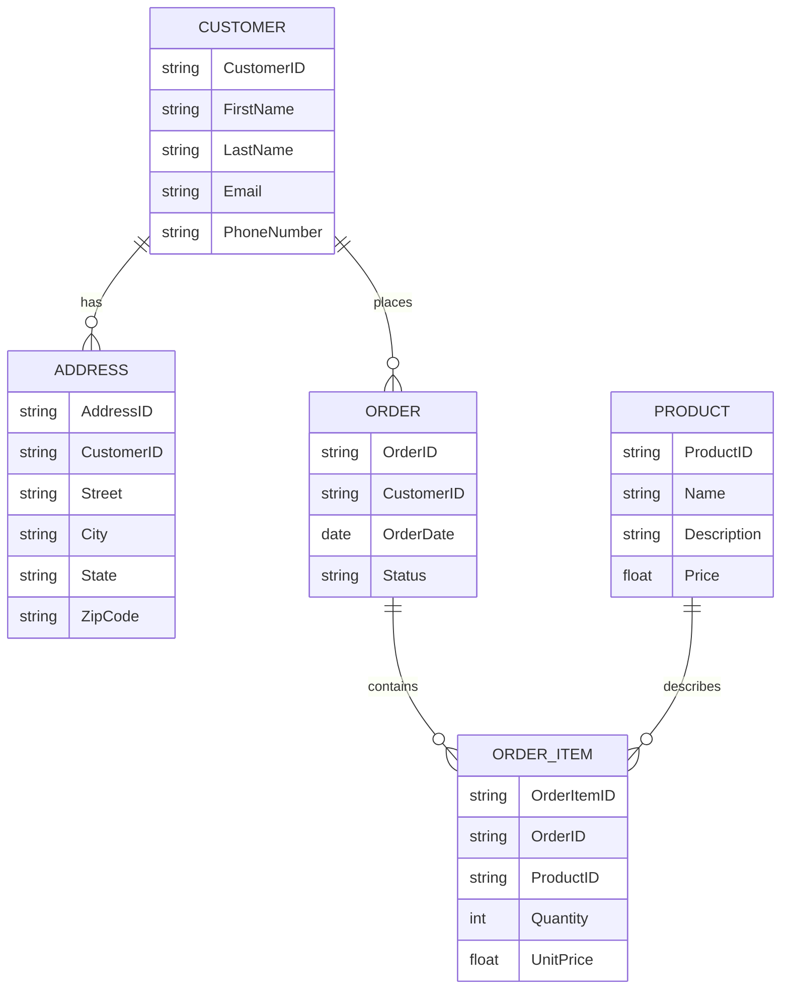
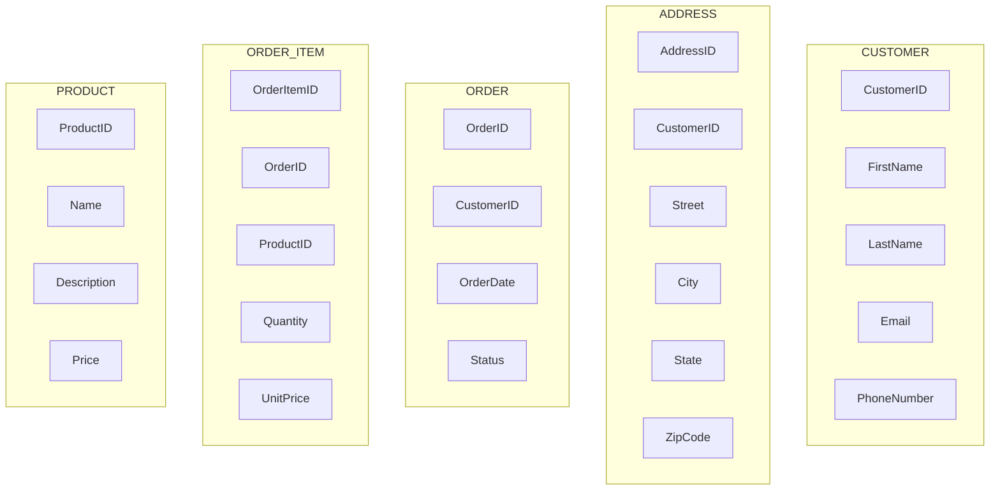
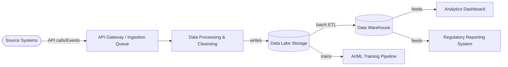

Be an Enterprise Architect who is documenting a Data Architecture using a Data Architecture Document (DAD).  Use the DAD Document Template below to build out the Data Architecture.  Please take the context of what's in this repo and read and understand it.  Then read over the template and then ask me questions until you get enough information and then start filling out the template. 
<Data Architecture DocumentTemplate>


# Information Systems Architecture: Data

*This template is intended for internal IT software products at an electric utility, following Agile best practices (with flexibility for some Waterfall processes). The Data Architecture defines how data is structured, sourced, governed, and flows across the enterprise to support business capabilities and strategic objectives. It ensures alignment with enterprise principles, regulatory requirements, and operational needs by documenting logical models, data lifecycle, quality controls, and security measures. This foundation enables consistent, trustworthy, and well-governed data usage across applications, processes, and stakeholders.*

**Use of AI:** This template has been built to be used by Large Language Models to help you create the template and for you to perform a quality check on your template.  Finally LLMs can give you impact analysis on the quality check that it performed.  Here are several prompts to use with this template.

```markdown
Prompt to Build:  Be an Product Owner Responsible for building an Data Architecture.  Use the Data Architecture Template below to build out the Data Architecture.  I have attached documents that cover many of the information needed to fill out the template.  Read this attached information and then read over the template and then ask me questions until you get enough information and then start filling out the template. 
<Data Architecture Template>
{Insert this template here}
```

```markdown
Prompt to perform a QDRT:  Be an member of a Quality Design Review Team who is trying to determine if a Data Architecture is complete enough to proceed into Construction.  Use the Data Architecture Template below to compare the attached Data Architecture to standards.  Use your own knowledge and the attached template to perform your assessment.  The review should contain an assessment of quality using a 6 point scale from Excellent to Unacceptable.  It should contain an assessment of Clarity and Completeness using a 3 point scale from Exceeds Expectations to Does Not Meet Expectations. It should contain an assessment of Recommended Next Steps that Include: Approved as-is to proceed to human review, Approved with Minor Revisions, Unapproved with Major Revisions.  It should then list out each item that does not meet expectations.  Finally, each piece of Feedback should have each of the following sections under each piece of feedback.  Feedback Item / Description: Briefly describe what is missing or unclear.  Impact: Describe the impact to the overall effort if not addressed in terms a non-technical college student could understand. Recommendation: Suggest specific corrective actions. Priority: Critical, High, Medium, Low.  Estimation Time To Fix: Number of hours it commonly takes to address this shortcoming.

<Data Architecture Template>
{Insert this template here}
```
## Strategic Alignment & Principles

\<Purpose\>

The Strategic Alignment & Principles section establishes the "Why" by linking the Data Architecture to the enterprise’s business drivers and principles. It articulates how the data architecture supports key business goals, constraints, and values defined in earlier phases (such as the Architecture Vision from Phase A). This ensures the data design is rooted in business needs and guided by overarching data principles (e.g., treating data as an asset, promoting sharing and accessibility, assigning ownership). Additionally, this section introduces high-level data strategies for metadata and Master Data Management (MDM), and outlines lifecycle considerations aligned with compliance requirements.

\<Instructions\>
  
1. **Align with Architecture Vision:** Summarize how this Data Architecture initiative responds to specific business drivers and objectives identified in the Architecture Vision (Phase A). For example, explain how improved data management will address a business need (e.g., regulatory compliance, better customer insights, operational efficiency) and align with corporate strategy.  
2. **State Data Principles:** List and describe relevant enterprise data principles that apply. For instance, clarify what "Data is an Asset" means for this project (e.g., data is managed with the same rigor as financial assets) or how principles like "Data is Shared" and "Data is Accessible" will be achieved (through governance, self-service tools, etc.). If your organization has a principle such as "Data has a Single Owner," identify the accountable owner roles for key data domains. Reference any formal Enterprise Architecture or Information Management Principles documents to show compliance and alignment.  
3. **Metadata & Master Data Strategy:** Outline the approach for metadata management and master data management in this solution. Indicate how the architecture will handle metadata (e.g., data cataloging, lineage tracking, business glossary definitions) and describe the MDM approach (centralized vs. federated) for critical data entities. Mention any standard tools or platforms (such as *Informatica*) used to implement these strategies, and how they integrate into the broader data ecosystem and governance processes.  
4. **Data Lifecycle & Retention:** Describe the expected lifecycle of key data entities – from creation and active use to archival and deletion. Include retention requirements or policies (for example, records retained for 7 years to meet compliance) and note any regulatory influences (like GDPR or CCPA) on these policies. If helpful, include a diagram or table to visualize data lifecycle stages (Create, Read, Update, Archive, Delete) for major entities. Ensure this covers how archival and purging will be handled to comply with legal and business requirements.  
5. **Ensure Principle Compliance:** Demonstrate how the solution adheres to enterprise data standards or policies. If the organization has a Data Management or Data Governance framework, mention how this architecture aligns with those guidelines (for example, by following a Corporate Data Management Framework or being reviewed by a Data Governance Board). Emphasize that design decisions are grounded in accepted principles and policies, which will make the architecture more consistent and easier to govern.

\<Example\>
  
A global enterprise is pursuing a strategic goal of becoming more **data-driven**. To support this, the Data Architecture is aligned with the **Architecture Vision** by emphasizing accessible and high-quality data. Under the principle **"Data is an Asset"**, customer and product information are consolidated into a governed data hub, treating these datasets as valuable corporate resources. Adhering to **"Data is Shared"** and **"Data is Accessible"**, the architecture introduces a self-service data catalog (using tools like *Informatica EDC* or *Collibra*) so business analysts can easily discover and trust data. A clear **metadata strategy** documents data lineage and definitions for all key metrics, ensuring transparency about data origin and meaning. In addition, a **Master Data Management** program designates a single source of truth for core entities (Customer, Product), preventing siloed or inconsistent data across applications. Each data entity’s **lifecycle** is defined: for example, customer records are created in the CRM system, updated via a customer portal, archived after 7 years of inactivity, and then deleted in accordance with GDPR-compliant retention rules. By grounding the architecture in these principles and strategies, the solution directly supports business needs (like improved customer insight and regulatory compliance) and aligns with the company’s long-term data governance vision.

\<Prerequisites\>
  
* Documentation from **Phase A (Architecture Vision)** – including business drivers, goals, and initial architecture principles that set the context for data needs.  
* Enterprise **Information Management Principles** or **Data Strategy** documentation that outlines approved data principles (to ensure alignment).  
* Business context materials such as strategy documents or key performance indicators that the data architecture is expected to influence.

\<Standards\>
  
* **TOGAF Standard – Phase C: Data Architecture (Part II)** – Guidance on developing Data Architecture in TOGAF’s ADM, ensuring alignment with business objectives and integration of data principles.  
* **TOGAF Standard – Architecture Principles (Part III, Chapter 20)** – Descriptions of Enterprise Architecture principles (including data principles like *Data is an Asset, Data is Shared, Data is Accessible, Data has a Single Owner*) that inform architecture decisions.  
🔗 [TOGAF 9.2 – Data Principles](https://pubs.opengroup.org/architecture/togaf9-doc/arch/chap20.html#tag_20_06_02)

### Architecture Vision Alignment

\<Purpose\>

Explain *exactly* how the proposed data architecture advances the organization’s Architecture Vision. The narrative should translate strategic business drivers into data‑centric objectives, showing clear cause‑and‑effect between business motivation and data capabilities.

\<Instructions\>
  
1. **Restate Business Drivers:** In 1‑2 sentences recap the primary business goals, opportunities, or pain points that the Architecture Vision highlights.  
2. **Link to Data Capabilities:** Describe which data capabilities (e.g., single source of truth, real‑time analytics, data democratization) directly respond to those drivers.  
3. **Identify Constraints:** Mention any business‑imposed limits (budget, timeline, regulatory) that shaped the data design.  
4. **Articulate Strategic Contribution:** Spell out *how* this data architecture accelerates revenue growth, cost optimization, risk reduction, or customer experience targets.  
5. **Keep it Strategic:** Avoid schema or technology minutiae; focus on business value and traceability to the Vision.

\<Example\>
  
The Architecture Vision calls for “real‑time, hyper‑personalized energy insights for all residential customers by 2027.” The proposed data architecture fulfills this by introducing an enterprise event‑stream capturing 20M smart‑meter signals per hour, harmonized in a cloud data lakehouse. This capability underpins two strategic metrics: a 12‑point increase in Net Promoter Score and a projected $18 M reduction in call‑center costs through proactive alerts.

\<Prerequisites\>
  
* Approved **Architecture Vision** document (ADM Phase A output)  
* Business‑Case slide deck or *Value Proposition Canvas*  
* Stakeholder analysis showing data‑related pain points

\<Standards\>
  
* **TOGAF 10 – Phase C: Data Architecture**  
* **Business Motivation Model (BMM)** – OMG specification for tracing vision to capabilities  

### Applicable Data Principles

\<Purpose\>

Document the enterprise or domain‑specific data principles that will govern all design, build, and run activities. These principles anchor decision‑making and ensure solution‑level choices stay aligned with enterprise ethos.

\<Instructions\>
  
1. **List Each Principle Clearly:** Use the organization’s canonical wording (e.g., “Data is an Asset”).  
2. **Provide a Short Interpretation:** Explain what the principle *means* in the context of this initiative.  
3. **State Architectural Implications:** Summarize the design rules or policies driven by the principle (e.g., “must expose data via APIs, not files”).  
4. **Highlight Conflicts or Trade‑offs:** If principles appear to clash (e.g., “Data is Accessible” vs. “Data is Secure”), flag how the architecture balances them.  
5. **Keep to One Paragraph per Principle.**

\<Example\>
  
**Data is an Asset** – Customer and grid telemetry data are treated as strategic assets; ownership is assigned to the Data Product Owners, and value realization is measured quarterly by analytics adoption KPIs.  
**Data is Secure** – All personally identifiable information (PII) is classified *Restricted* and encrypted both in transit (TLS 1.3) and at rest (AES‑256).  

\<Prerequisites\>
  
* Enterprise‑level **Data & Information Principles** register  
* Information security policy and data‑classification matrix  
* DAMA DMBOK or internal data‑governance handbook

\<Standards\>
  
* **TOGAF 10 – Architecture Principles (Part II, § 6)**  
* **DAMA‑DMBoK2 – Chapter 3: Data Governance**  

### Metadata and Master Data Strategy

\<Purpose\>

Define how metadata and master data will be created, curated, governed, and shared so that downstream applications, analytics, and business processes can rely on high‑trust, well‑described information.

\<Instructions\>
  
1. **Scope the Domains:** Specify which master‑data domains (e.g., Customer, Asset, Location) are in or out of scope.  
2. **Choose an Operating Model:** Centralized, federated, or hybrid; justify the choice.  
3. **Tooling & Platforms:** Name the catalog, lineage, and MDM tools (e.g., Collibra, Informatica MDM SaaS).  
4. **Governance & Stewardship:** Outline roles (Data Owner, Steward) and decision rights.  
5. **Integration Patterns:** Describe how golden records propagate (publish/subscribe, RESTful API, CDC, etc.).  
6. **Quality & KPI Framework:** Identify critical data‑quality rules (completeness, uniqueness) and how they’re measured.  

\<Example\>
  
A *hub‑and‑spoke* MDM pattern will govern **Customer** and **Meter** domains. Collibra Data Catalog auto‑ingests technical metadata from Snowflake and maps it to business glossary terms. Informatica Cloud MDM maintains golden Customer records, pushing changes via event streams to CRM and billing. Data Quality KPIs (duplicate rate < 0.1 %, address completeness > 98 %) are monitored in PowerBI and reported monthly to the Data Governance Council.

\<Prerequisites\>
  
* Current‑state system inventory and data‑domain mapping  
* Data‑quality assessment reports  
* Existing metadata catalog (if any) and stewardship roster

\<Standards\>
  
* **ISO/IEC 11179 – Metadata Registries**  
* **Gartner MDM Reference Model**  
* **TOGAF 10 – Data Catalog and Data Lifecycle Artifacts**  

### Data Lifecycle and Retention

\<Purpose\>

Describe each key data entity’s journey from creation through archival or destruction, ensuring retention rules meet legal, regulatory, and business needs.

\<Instructions\>
  
1. **Identify Key Entities:** List primary tables or objects (Customer, Transaction, Event).  
2. **Map Lifecycle Phases:** Create clear Create, Read, Update, Archive, Delete (CRUD‑AD) paths; a simple table or swim‑lane diagram is ideal.  
3. **Set Retention Rules:** State how long each entity or attribute is kept (e.g., 7 years for billing records) and cite the governing regulation or policy.  
4. **Define Archival & Purge Mechanisms:** Specify cold‑storage tier, anonymization process, or secure erase standard (e.g., NIST 800‑88).  
5. **Note Restoration & Access SLAs:** If archived data must be retrievable within X hours, record it.  
6. **Address Compliance & Audit:** Show how evidence of retention/purge is logged and reviewable.  

\<Example\>
  
| Data Entity       | Create Source | Hot Store Retention            | Archive Tier              | Final Disposal        | Compliance Driver   |
| ----------------- | ------------- | ------------------------------ | ------------------------- | --------------------- | ------------------- |
| Smart‑Meter Event | IoT Gateway   | 12 months in Delta‑Lake Bronze | 5 yrs in S3 Glacier       | Crypto‑shred at 5 yrs | CPUC Decision XX‑YY |
| Customer Account  | CRM           | Lifelong + 2 yrs after closure | 10 yrs in Azure Blob Cool | NIST wipe at 10 yrs   | SOX § 404           |
| Outage Ticket     | ServiceNow    | 2 yrs                          | 8 yrs                     | Delete                | FEMA Grant Rules    |

\<Prerequisites\>
  
* Corporate retention schedule and legal counsel memo  
* Data‑classification register  
* Storage‑tier cost model

\<Standards\>
  
* **GDPR (Art. 5 & 17)** – data minimization & right to erasure  
* **CCPA** – consumer deletion rights  
* **NIST SP 800‑88 Rev. 1** – media sanitization  
* **TOGAF 10 – Data Lifecycle Diagram Artifact**  

## Foundational Data Inputs

\<Purpose\>

The Foundational Data Inputs section establishes the "What" by identifying and describing all data sources that will be used in the solution. It ensures that for each data source, key details are captured – including origin, content, quality, and any constraints – so stakeholders understand exactly what data underpins the architecture. This section also documents the rationale behind selecting these data sets (why they were chosen) and confirms that relevant stakeholders (such as data owners or stewards) have approved their usage. By thoroughly outlining data inputs upfront, the architecture team and business stakeholders can be confident in the data’s suitability, governance, and compliance before it is used in design, modeling, or implementation.

\<Instructions\>
  
1. **Enumerate Data Sources:** List every data source involved in the solution (internal systems, external datasets, streaming feeds, etc.). For each source, provide detailed information covering:  
   * *Data Source & Description:* Identify the source (name or system) and describe its content and format. Include what kind of information it contains (structured tables, unstructured text, images, etc.), key fields or variables, and its general purpose or business context.  
   * *Collection Process:* Explain how the data is collected, generated, or updated. Note the frequency of updates (real-time, hourly, daily batch), and methods or instruments used (manual entry, sensors, web APIs, third-party feed). If the data includes personal or sensitive information, mention how consent was obtained or usage rights were confirmed during collection.  
   * *Data Modification:* Describe any transformations or preprocessing applied to the raw data before use. This could include joins with other data, cleaning steps, encoding or normalization, creation of synthetic data, or feature engineering for analytics. Clearly state if any data attributes are derived or calculated (and how).  
   * *Quality & Completeness:* Summarize the known quality of this data source. Include metrics or observations about completeness (e.g., percentage of missing fields), accuracy, timeliness, and any bias or representational issues. If the data only covers certain populations or regions (geographical or demographic limitations), note how that might affect its use for the intended audience or model. Document any initial data profiling results or known issues (e.g., duplicate records, outliers) for this source.  
   * *Privacy, Security, and Licensing:* Note the classification of the data (confidential, public, personal data, etc.) and what measures are in place to protect it (encryption, access controls, anonymization techniques). Include any usage restrictions, licenses, or legal regulations associated with the data. For example, if it’s purchased data, what are the licensing terms? If it contains personal data, how does it comply with privacy laws (GDPR, CCPA)?  
   To keep things organized, you may create a sub-section for each data source (see section 1.2.1.x) using a consistent template of these details. This makes it easy for reviewers to find all relevant information about each source.  
2. **Justify Data Selection:** Explain why each data source was selected for this effort (as opposed to other available data). Outline the criteria used for selection, such as: relevance to the business problem, data quality and coverage, legal or compliance clearance, and technical compatibility with the solution. If any important criteria were set (for example, data must be less than 2 years old, or must cover at least 95% of customer base), indicate how the chosen data meets them. Also note if alternative sources were considered and why they were not chosen (e.g., another dataset was outdated, or had licensing issues). This justification shows due diligence in picking the best inputs (see section 1.2.2 for capturing selection criteria across business, quality, legal, and technical dimensions).  
3. **Account for Constraints:** For each category of selection criteria, detail any specific constraints or requirements that affected data selection:  
   * *Business Process Constraints:* e.g., certain data might only be available during specific business process cycles or might be owned by a department that limits access. Document how business workflow timing or ownership influenced data availability.  
   * *Data Quality Constraints:* e.g., the project may require a minimum data completeness or accuracy level. Note if some data sources were excluded or supplemented due to quality issues.  
   * *Legal/Regulatory Constraints:* e.g., privacy regulations might forbid using certain personal data without consent, or cross-border data transfer laws might limit using data stored in another country. Explain any legal restrictions and how they were navigated (such as using anonymization or obtaining special approvals).  
   * *Technical Constraints:* e.g., data format or volume might necessitate certain tools, or real-time streaming might require specialized infrastructure. Note if some sources needed to be pre-processed or if the team had to build new pipelines due to technical considerations.  
   Summarize how these constraints were addressed or mitigated in choosing and preparing the data. This could be documented in section 1.2.2 as part of the selection criteria discussion.  
4. **Stakeholder and Steward Approvals:** Record any approvals or agreements obtained from data stakeholders (section 1.2.3). This includes business data owners, data stewards, legal/compliance officers, or other relevant parties. Document the names or roles of approvers, what they approved (e.g., use of customer data for analytics, sharing of data between departments), and any conditions attached to the approval. If there was a formal governance review or committee sign-off before using the data, note the outcome. This step ensures that the use of each data source is transparent, authorized, and aligned with corporate data governance policies *before* proceeding to development or modeling.

\<Example\>
  
**Scenario:** An organization is building a predictive model to anticipate customer churn for a subscription service. The team identified two key data sources for this solution:

* **Internal CRM Database:** This system-of-record contains customer profiles and subscription history. It includes structured tables with customer demographics, account start/end dates, product subscriptions, and customer service interactions. *Collection Process:* Data is captured during customer onboarding and through ongoing operational updates (e.g., when customers contact support or change their plan), with entries made via the CRM UI and automated updates from the billing system. *Data Modification:* Prior to modeling, the team extracts relevant fields (like tenure, last login date, support ticket count) and joins them with the billing data to calculate derived features (e.g., average monthly usage). *Quality & Completeness:* The CRM data is high-quality for active subscribers (e.g., >98% of records have complete key fields such as contact info and start date), though some older records have missing demographic details. No major biases are present since it covers the full customer base, but the team noted that churn reasons were blank in 20% of records. *Privacy & Security:* This data is classified as confidential customer PII; it is stored on encrypted databases and only accessible by authorized analytics personnel. *Usage Permissions:* Per company policy, customer data can be used for internal analytics under the service agreement’s privacy notice – the data steward (head of customer data) reviewed and approved its use for this churn model.  
* **External Demographic Enrichment Data:** A third-party dataset was purchased to enhance customer records with regional demographics (e.g., median income, urban/rural indicator, family size index by postal code). *Collection Process:* The data is collected by the third-party via public records and surveys; the subset relevant to the company’s customer postal codes is delivered as monthly CSV files. *Data Modification:* The team maps this data to customers by postal code and creates a lookup table for model use. *Quality & Completeness:* The data is generally good quality on a per-region basis, but some rural postal codes have incomplete info (the provider flagged ~5% of delivered records with partial demographic fields). There is also a slight bias since some remote areas aren’t covered, which was noted as a limitation (the model might be less accurate for those regions). *Privacy & Security:* The enrichment data contains no direct personal identifiers (it’s aggregated by region), reducing privacy concerns, but it is licensed for internal use only. *Usage Permissions:* The licensing agreement from the vendor allows the company to use the data for analytics but not to redistribute it. The legal team reviewed the vendor contract, and the Chief Data Officer approved incorporating this data, ensuring it does not violate any customer privacy commitments.  

These two sources were chosen because together they satisfy the **business relevance** (internal CRM shows actual customer behavior; external data adds context that correlates with churn) and meet **quality standards** (CRM data is complete and timely; third-party data is reputable and regularly updated). Alternatives like social media data were considered but rejected due to **legal constraints** (customer consent would be required) and **technical constraints** (unstructured text would require complex processing). All selections and constraints were documented, and the Data Governance Council was briefed to obtain necessary stakeholder buy-in before moving to the modeling phase.

\<Prerequisites\>
  
* An **inventory or catalog of available data sources**, possibly from a data catalog tool or initial discovery phase, to know what data could be considered for the project.  
* **Business requirements or analytics use case definition** outlining what information is needed to address the problem (helps filter relevant vs. irrelevant data).  
* Input from **Legal/Compliance and Data Privacy** teams on any data usage restrictions, ensuring only data that can be legally and ethically used is selected.

\<Standards\>

* **DAMA DMBOK (Data Management Body of Knowledge)** – Industry best practices for documenting data sources, metadata, and ensuring data quality in an initiative:contentReference[oaicite:0]{index=0}:contentReference[oaicite:1]{index=1}. Following DMBOK guidelines helps ensure all necessary details (like data origin, quality, metadata) are captured for each source.  
* **Corporate Data Governance Policy** – Internal standards or procedures (often aligned with regulations like GDPR/CCPA) for approving new data usage. Adhering to these ensures that data selection is reviewed and compliant with privacy and usage policies before use.

### Data Sourcing Details

\<Purpose\>

Provide a comprehensive profile of **every** data source the architecture will consume. This section ensures stakeholders understand origin, quality, security, and licensing considerations before data is ingested or integrated.

\<Instructions\>
  
1. **Enumerate All Sources:** Include operational databases, SaaS APIs, third‑party datasets, sensors/IoT feeds, spreadsheets, etc.  
2. **Use the Sub‑Template:** For each source, fill out the “\[Data Source Name] – Details” block below.  
3. **Focus on Decision‑Critical Facts:** Quality ratings, privacy class, ownership, licensing, ingestion cadence.  
4. **Maintain Traceability:** Cross‑reference each source to business capabilities or data products that rely on it.  
5. **Keep Language Non‑Technical:** Avoid deep schema or ETL code; emphasize business relevance and risk posture.

\<Example\>
  
The solution ingests four primary sources: **Customer CRM**, **Smart‑Meter Telemetry**, **Weather API**, and **Public Demographic Data**. Each is profiled in its own block, detailing ingestion frequency (batch vs. real‑time), PII classification, stewardship, and licensing (e.g., NOAA Open Data License for weather).

\<Prerequisites\>
  
* Current‑state data inventory or system landscape diagram  
* Data‑sharing contracts or SLAs with third parties  
* Information‑security classification register

\<Standards\>
  
* **TOGAF 10 – Data Catalog Artifact**  
* **DAMA‑DMBoK2 – Chapter 5: Data Sourcing & Acquisition**  

#### \[Data Source Name] – Details

\<Purpose\>

Provide a repeatable, one‑page reference for a *single* data source so architects, stewards, and auditors can quickly grasp its key attributes and constraints.

\<Instructions\>
  
Fill in each field below. Keep each answer concise—one to three sentences or bullet points.

**Data Source:** *System of record or provider (e.g., “Salesforce CRM”)*
**Data Description:** *High‑level summary of the type and scope of data*
**Data Collection Process:** *How data is captured or received (batch file, API, event stream)*
**Data Modification:** *Transformations before landing (masking, normalization)*
**Data Quality & Completeness:** *Known quality metrics or issues; last profiling date*
**Data Privacy & Security:** *Classification, encryption at rest/in transit, RBAC model*
**Data Usage Permissions & Licensing:** *Internal policy, third‑party license terms, expiry*

\<Example\>
  
**Data Source:** Salesforce CRM
**Data Description:** Active and historical customer account records (≈4 M rows)
**Data Collection Process:** Nightly CDC extract via MuleSoft API (\~01:00 UTC)
**Data Modification:** Email addresses hashed; phone numbers standardized to E.164
**Data Quality & Completeness:** 98 % completeness; duplicate rate 0.3 %; last Dataedo profile 2025‑05‑10
**Data Privacy & Security:** PII classified *Restricted*; TLS 1.3 in transit, AES‑256 at rest
**Data Usage Permissions & Licensing:** Enterprise CRM license; internal use only, no resale

\<Prerequisites\>
  
* Data‑profiling report for the source  
* Security‑architecture review notes  
* Copy of data license or MSA (if third‑party)

\<Standards\>
  
* **ISO/IEC 25012 – Data Quality Model**  
* **NIST Privacy Framework v1.0**  

### Data Selection

\<Purpose\>

Document *why* each data source was chosen (or rejected) against business, quality, legal, and technical constraints, proving that the final data set is fit for purpose.

\<Instructions\>
  
1. **Summarize Selection Methodology:** Describe the evaluation process (scorecards, RACI workshops, pilots).  
2. **Address Four Constraint Areas:** Business Process, Data Quality, Legal/Regulatory, Technical.  
3. **Explain Exclusions:** List any candidate datasets rejected and the rationale.  
4. **Highlight Trade‑Offs:** Note compromises (e.g., lower freshness accepted for higher quality).  
5. **Tie Back to Requirements:** Reference specific business/user stories the selected data satisfies.

\<Example\>
  
After evaluating seven candidate weather feeds, the team selected **NOAA’s NWS API** because it met SLA latency (<5 min), offered open licensing, and aligned with corporate sustainability goals, whereas two commercial feeds were excluded due to high cost and restrictive redistribution terms.

1. *Business Process Constraints:* Real‑time outage response requires sub‑10‑minute latency; three legacy batch files were excluded.
2. *Data Quality Constraints:* Minimum 95 % geolocation accuracy; one dataset failed at 90 %.
3. *Legal / Regulatory Constraints:* California Consumer Privacy Act prohibits unmasked customer PII; raw social‑media sentiment feed was excluded.
4. *Technical Constraints:* Snowflake native connector required; an on‑prem Oracle feed was deferred due to integration cost.

\<Prerequisites\>
  
* Data evaluation scorecards  
* Risk & compliance assessment results  
* Technical feasibility POCs

\<Standards\>
  
* **TOGAF 10 – Requirements Traceability**  
* **ISO / IEC 38505‑1 – Governance of Data**  

### Stakeholder and Data Steward Approval

\<Purpose\>

Capture formal endorsements from data owners, stewards, legal, and business stakeholders, ensuring accountability and auditability before data is used in production.

\<Instructions\>
  
1. **List All Approvers:** Name, role, organization, and area of responsibility.  
2. **Record Approval Scope:** Which data sources, use‑cases, and time periods are covered.  
3. **Note Conditions or Caveats:** E.g., “Must purge records older than seven years,” “PII may not leave US region.”  
4. **Include Dates & Artifacts:** Meeting minutes, e‑signatures, Jira tickets.  
5. **Maintain Version History:** Update this section whenever new data or use‑cases are added.

\<Example\>
  
| Approver    | Role                               | Data Scope Approved               | Date       | Conditions                    |
| ----------- | ---------------------------------- | --------------------------------- | ---------- | ----------------------------- |
| Jane Kim    | VP Customer Ops                    | Salesforce CRM data for analytics | 2025‑06‑01 | Quarterly quality review      |
| Ravi Patel  | Chief Information Security Officer | All PII classes                   | 2025‑06‑03 | Encrypt at rest & transit     |
| Maria Lopez | Privacy Counsel                    | Weather & Demographic open data   | 2025‑06‑05 | Attribution footnote required |

\<Prerequisites\>
  
* RACI matrix for data governance  
* Signed Data‑Sharing Agreements or DPAs  
* Architecture Review Board minutes

\<Standards\>
  
* **TOGAF 10 – Stakeholder Management Technique**  
* **ISO/IEC 27001 – Annex A.18 (Compliance)**  
* **DAMA‑DMBoK2 – Chapter 11: Data Security**  

## Data Quality & Bias Evaluations

\<Purpose\>

The Data Quality & Bias Evaluations section establishes trust in the data by rigorously examining its quality and potential biases. For data-driven solutions (especially AI/ML models), it's crucial to ensure that the input data is accurate, consistent, and fair. In this section, you will document plans and results of data quality assessments and bias testing. It outlines how any issues like missing or inconsistent data were addressed, what bias mitigation steps were taken, and the overall data cleaning approach. By proactively managing data quality and bias, the architecture ensures that the solution’s outputs will be reliable and unbiased, aligning with the organization’s ethical standards and data governance policies.

\<Instructions\>
  
1. **Bias Evaluation Plan:** Describe the approach for evaluating bias in the dataset (see section 1.3.1.1). Identify which types of bias are relevant to the use case (e.g., sampling bias, historical bias, or algorithmic bias in training data) and how you plan to detect and measure them. Involve subject matter experts or stakeholders from the business domain to review this plan. Reference any organizational frameworks (such as an **AI/ML Model Risk Governance Framework**) or industry guidelines that mandate bias checks. Ensure the scope of bias testing is commensurate with the project’s risk level; high-impact decisions require more extensive bias analysis and documentation.  
2. **Data Quality Issues & Mitigation:** Identify any data quality problems discovered and how they were handled (section 1.3.1.2). For example, list issues like missing values, duplicate records, inconsistent formats, outliers, or any anomalies. For each issue, document what action was taken: did you remove the problematic data, correct it, or impute values? If no action was taken for an issue, explain why (perhaps the issue was minor or acceptable for this context). Note whether you engaged data owners to fix certain issues at the source (and if so, what the outcome was). Keeping a log of issues and resolutions helps stakeholders understand the reliability of the data.  
3. **Data Cleaning Approach:** Explain the overall strategy used to improve data quality (section 1.3.1.3). Detail the steps in the data cleaning pipeline – e.g., data normalization, transformation rules applied, filtering criteria, and imputation methods for missing data. Provide the reasoning behind each major step: why certain threshold values were chosen, why outliers were treated in a particular way, or why a specific imputation technique (mean, median, KNN, etc.) was used. Additionally, describe plans for maintaining data quality over time if the solution will run with new incoming data (for instance, implementing validation checks or alerts for data drift in production). If the proposed solution itself introduces new data (e.g., new data fields or a new data collection process), discuss potential quality issues from those and how you plan to mitigate them in both the short term and long term.  
4. **Structured Quality Impact Summary:** Use structured formats (like the YAML examples provided in sections 1.3.1.4 and 1.3.1.5) or tables to summarize specific data quality issues and their business impact. For completeness issues (missing data) and consistency issues (data field mismatches), list the data elements affected, expected vs. observed quality levels, the risk level of each issue, and what business processes or use cases are impacted. Include also the root cause (if known) and the mitigation actions taken. This provides a clear, concise view for stakeholders and can be referenced in governance reviews or audit processes.  
5. **Maintain Records and Governance:** Ensure that all bias evaluation results and data quality improvement actions are recorded and stored (with versioning if possible). These records should be maintained for as long as the system is in use, serving as an audit trail. This is important for compliance (especially for AI systems under regulatory oversight) and for any future troubleshooting. It also demonstrates adherence to the company’s data governance and AI ethics standards. Regular reviews (e.g., by a data governance committee or AI ethics board) might be referenced here to show that the data was vetted and approved for use after cleaning and bias mitigation.

\<Example\>
  
During development of a **customer analytics model**, the team conducted extensive data quality and bias evaluations on the training dataset:  

* **Bias Evaluation:** The dataset contained customer records from multiple regions, and analysis showed a potential sampling bias – customers from Region A were  under-represented compared to other regions. To address this, the team supplemented the training data with additional samples from Region A and applied weighting to ensure the model wouldn’t be skewed against that region. They also consulted a domain SME to review if any critical customer segment was missing. Additionally, they checked for **historical bias** in customer churn reasons and found none that would unfairly target a group (e.g., no particular demographic had systematically different data recording). The bias evaluation approach and findings were documented and reviewed under the company’s AI Model Risk Governance Framework to ensure thoroughness.  
* **Data Quality Issues:** One significant issue discovered was that about 8% of customer records had a missing *Last Activity Date* (a completeness issue). The team decided to impute these missing dates using a conservative approach (replacing with the median last activity of similar customers), noting this might slightly reduce model accuracy but would avoid biasing results. They also found a consistency issue: the *Country* field had mixed formats (some entries were full country names, others used 2-letter codes). To fix this, all country data was standardized to ISO 2-letter codes during preprocessing. Another minor issue was duplicate customer entries (around 50 duplicates out of 50,000 records), which were removed after verification. Each issue and action was logged; for example, the missing date issue was recorded with a High risk level since it could affect churn calculations, and the duplicates with a Low risk after removal.  
* **Data Cleaning & Ongoing Monitoring:** The initial data cleaning involved running scripts to perform the above corrections and transformations. After cleaning, metrics showed improvement (e.g., completeness for critical fields reached 99+%, and all country entries followed a consistent format). The team set up an automated data quality report to run on new data each week, which checks for spikes in missing values or any new inconsistent formats. This ensures that if, say, a new country code appears in full name instead of code, it triggers a flag for the data engineer to address. All cleaning decisions and quality metrics were documented, and the updated dataset was signed off by the Data Steward before model training. By maintaining this rigorous approach, stakeholders have confidence that the data underpinning the analytics is both reliable and fair.

\<Prerequisites\>
  
* **Initial data profiling reports** or outputs from data quality assessment tools (if available), to understand the baseline state of data before cleaning.  
* **List of critical data fields and acceptable quality thresholds** (often from requirements or domain experts) to know what quality levels must be met (e.g., "no more than 1% missing values in customer gender field").  
* **AI/ML governance guidelines or ethical AI policies** (if applicable) that specify required bias checks or documentation needed for models, ensuring the team follows any mandated evaluation steps.

\<Standards\>
  
* **ISO 25012 Data Quality Model** – Provides a set of data quality characteristics (such as completeness, consistency, accuracy, timeliness):contentReference[oaicite:2]{index=2} that can be used as a reference for evaluating and reporting on dataset quality. Using a standard model ensures a comprehensive coverage of quality aspects.  
* **Organization’s AI Ethics & Risk Framework** – If the enterprise has guidelines (or follows industry standards like the **OECD AI Principles**) for bias mitigation and transparency in AI, those should guide this section. Adhering to such standards demonstrates that the data preparation aligns with broader ethical and governance commitments.

### Data Quality

#### Bias Evaluation Plan

\<Purpose\>

Define a systematic approach to detecting, measuring, and mitigating unwanted bias in any data used for analytics, ML models, or decision‑support. This ensures ethical compliance, regulatory alignment, and stakeholder trust.

\<Instructions\>
  
1. **Specify Bias Types:** List the protected attributes or domains you will test (e.g., race, gender, geography, device type).  
2. **Select Evaluation Methods:** Describe statistical tests, fairness metrics (e.g., demographic parity), or qualitative reviews.  
3. **Name Reviewers & Cadence:** Identify data scientists, domain experts, ethics committee members, and when each review occurs (design, pre‑prod, post‑prod).  
4. **Reference Frameworks:** Cite internal AI fairness checklists or external guidance (e.g., NIST SP 1270, IEEE P7003).  
5. **Document Remediation Paths:** Explain steps if bias is detected—re‑sampling, re‑weighting, feature removal, or business escalation.

\<Example\>
  
The team will evaluate **gender** and **ZIP‑code** bias in churn‑prediction data using *equal opportunity difference* metrics. Reviews occur quarterly by the AI Ethics Board; any metric > ±5 % triggers a mitigation sprint of bias‑aware re‑sampling followed by model re‑training.

\<Prerequisites\>
  
* Approved *Responsible AI* policy  
* List of protected or sensitive attributes per jurisdiction  
* Historical fairness audit reports

\<Standards\>
  
* **NIST SP 1270 – Towards a Standard for Identifying & Managing Bias in AI**  
* **IEEE P7003 – Algorithmic Bias Considerations**  
* **TOGAF 10 – Risk & Compliance Viewpoints**  

#### Data Quality & Bias

\<Purpose\>

Log all identified data‑quality defects and potential biases, along with disposition (fixed, mitigated, accepted). This creates transparency and a feedback loop to source‑system owners.

\<Instructions\>
  
1. **Catalog Issues:** State the defect or bias, source system, and discovery date.  
2. **Note Disposition:** Transform, remove, impute, or accept with rationale.  
3. **Alert Owners:** Record whether data stewards or system owners were informed.  
4. **Assess Residual Risk:** Qualitatively rate remaining impact (Low/Med/High).  
5. **Track Closure:** Include ticket numbers or change‑request IDs for traceability.

\<Example\>
  
*Issue:* Under‑representation of rural customers in marketing dataset (6 % vs. 18 % census baseline).  
*Disposition:* Accepted short‑term, flagged for Q4 data‑sourcing expansion; marketing analytics adjusted with population weights.  
*Owner Alerted:* Yes – CRM Steward (#JIRA‑3214).  
*Residual Risk:* Medium.

\<Prerequisites\>
  
* Data‑profiling outputs  
* Fairness metric dashboards  
* Issue‑tracking or JIRA board

\<Standards\>
  
* **ISO/IEC 25012 – Data Quality Characteristics**  
* **DAMA‑DMBoK2 – Data Quality Management**  

#### Data Cleaning Approach

\<Purpose\>

Describe the end‑to‑end data‑cleansing regimen—both initial remediation and ongoing controls—so stakeholders understand how raw data is transformed into analysis‑ready information.

\<Instructions\>
  
1. **State Initial Condition:** Outline key problems (nulls, duplicates, invalid ranges).  
2. **List Cleaning Steps:** E.g., de‑duplication, standardization, outlier capping, format harmonization.  
3. **Explain Justification:** Tie each action to business/analytics requirements.  
4. **Define Continuous Controls:** Real‑time validations, nightly DQ jobs, quarterly audits.  
5. **Identify Residual Risks & Mitigations:** What issues may still appear and how you will address them.

\<Example\>
  
Starting dataset had 12 % duplicate IDs and 7 % invalid email formats. A deterministic hash‑based de‑duplication reduced duplicates to <0.1 %. Email regex validation moved bad addresses to a quarantine table for weekly steward review. Going forward, an Airflow DAG runs nightly *Great Expectations* tests; failures raise PagerDuty alerts to the Data Ops team.

\<Prerequisites\>
  
* Current‑state profiling report  
* ETL/ELT design documents  
* Data‑quality tool configurations

\<Standards\>
  
* **TOGAF 10 – Data Transformation Model**  
* **CMMI DQMM – Data Quality Maturity Model**  

##### Data Quality Impact: Completeness

\<Purpose\>

Record data elements whose missing values materially affect business outcomes, using a structured YAML format for quick parsing by both humans and machines.

\<Instructions\>
  
1. **Follow YAML Template:** One list item per element.  
2. **Quantify Completeness:** Provide expected vs. observed percentage.  
3. **State Business Impact & Use‑Cases:** Tie directly to downstream processes.  
4. **Root‑Cause & Mitigation:** Identify why gaps exist and the remediation plan.  
5. **Update Over Time:** Re‑profile at defined cadence and revise YAML.

\<Example\>
  
```YAML
- DataElement: CustomerBirthdate
  Description: Date of birth for customer verification and segmentation 
  SourceSystem: CRM-System-A 
  ExpectedCompleteness: 100% for KYC-compliant customers 
  ObservedCompleteness: 63% 
  RiskLevel: High 
  BusinessImpact: Impacts age-based risk scoring and product eligibility 
  UseCaseImpacted: Credit Scoring, Compliance Reporting 
  RootCause: Legacy records migrated from paper forms lacked DOB 
  Mitigations: 
    - Flag incomplete records in reports 
    - Initiate outreach for missing data 
  Notes: Coverage improving ~1%/month due to digital onboarding
```

\<Prerequisites\>
  
* Profiling results with completeness metrics  
* Business‑impact assessment worksheets

\<Standards\>
  
* **ISO/IEC 25024 – Measurement of Data Quality**  

##### Data Quality Impact: Consistency

\<Purpose\>

Capture cross‑system or intra‑system value conflicts that can distort analytics or operations, again employing a YAML schema for precision.

\<Instructions\>
  
1. **List Each Inconsistency:** Single YAML entry per attribute or code set.  
2. **Show Sample Values:** Provide concrete examples from multiple systems.  
3. **Assess Risk & Impact:** Business processes and reports affected.  
4. **Document Root‑Cause:** E.g., divergent validation rules, legacy formats.  
5. **Outline Mitigations:** Transformation rules, API‑level validation, master‑data harmonization.

\<Example\>
  
```YAML
- DataElement: CustomerState
  Description: State or province of residence for regional reporting
  SourceSystems: [CRM, ERP]
  ExpectedConsistency: 2-letter ISO state codes across all systems
  ObservedInconsistencies: Mismatched formats ("California" vs "CA")
  RiskLevel: Medium
  BusinessImpact: Skews regional sales reporting and tax calculations
  UseCaseImpacted: Financial Reporting, Regional Campaign Targeting
  RootCause: Different input validation rules across systems
  Examples:
    - FieldValueDifferences:
        - SourceSystem: CRM
          Value: "California"
        - SourceSystem: ERP
          Value: "CA"
  Mitigations:
    - Standardize values during ETL
    - Harmonize front-end validation in CRM
  Notes: CRM migration roadmap includes field normalization in Q3
```

\<Prerequisites\>
  
* Cross‑system data‑comparison queries  
* Master Data Management (MDM) gap analysis

\<Standards\>
  
* **ISO/IEC 11179 – Metadata Registries**  
* **DAMA‑DMBoK2 – Data Integration & Interoperability**  

## Logical Data Architecture

\<Purpose\>

The Logical Data Architecture section focuses on "How" data is structured, related, and flows within the solution, at an abstract level. It provides a technology-agnostic view of the data entities, their relationships, and how they map onto business functions and application components. This section captures the design of the data model (logical ER diagrams and definitions of entities), as well as how that model is utilized by applications and business processes. It also illustrates the pathways of data movement and transformation from sources to consumers. By outlining the Logical Architecture, stakeholders can verify that the data design will fulfill business requirements and that it aligns with enterprise standards – using established **Architecture Building Blocks (ABBs)** where possible and introducing **Solution Building Blocks (SBBs)** as needed for this specific solution.

\<Instructions\>
  
1. **Logical Data Model:** Present a high-level Entity-Relationship model of the main data entities and their relationships (section 1.4.1). This model should capture key business objects (for example, Customer, Order, Product) and how they relate to each other (one-to-many, etc.), independent of any specific database or technology. Use a clear notation – the provided Mermaid ER diagram syntax is one example – to visualize entities and relationships. If some entities correspond to standard enterprise data definitions (ABBs) and others are new (SBBs), you may annotate or color-code them for clarity.  
2. **Logical Entity Definitions & CRUD:** For each logical entity in the model, provide a brief definition and indicate its type (master data vs. transactional data, reference data, etc.) and system of record (if one exists in the enterprise). Then, outline how each entity is created, read, updated, or deleted across the solution’s components (section 1.4.2). This can be done with a CRUD matrix or a list. Identify which user roles, systems, or services perform each operation on the entity. For example, a *Customer* entity might be created by a CRM system and read by an order management system and a billing system. Include references or links to the enterprise data dictionary or metadata repository for these entities (for instance, an entry in *Informatica* metadata catalog) if such exists.  
3. **Data Model-to-Application Mapping:** Illustrate how the logical data model connects to the application architecture and business processes (section 1.4.3). Create a mapping diagram (using Mermaid flowcharts or similar) that shows, for each relevant business process or capability, which data model (or subset of entities) it uses, which application implements that, and which database or data store holds the data. This end-to-end mapping (Business Process → Data Entities → Application → Database) ensures traceability. Mark any component that is an enterprise-standard ABB (e.g., a common customer database) versus solution-specific SBB. This helps enterprise architects see reuse and integration points clearly.  
4. **Data Movement & Processing Flow:** Depict how data moves through the system from sources to targets and how it is processed along the way (section 1.4.4). Include an **End-to-End Data Flow Diagram** that shows sources producing data, any intermediary layers or transformations, and the final consumption points. Label major stages like ingestion, processing, storage, and dissemination. Additionally, provide a breakdown of **Data Processing Stages** in a table, describing what happens in each stage (ingestion, cleansing, enrichment, storage/output) and listing the tools or technologies involved (e.g., Kafka for ingestion, *Databricks* for cleansing, *Informatica* for enrichment, etc.). Mention example transformations in each stage (such as “normalize date formats” in cleansing). This gives a clear picture of the data pipeline within the logical design.  
5. **Data Dissemination:** Describe the channels through which data (or insights derived from it) is exposed to end-users or other systems (section 1.4.5). This could include internal dashboards, reports, APIs, or data feeds to external partners. Group them by type (internal vs external, real-time vs batch, interactive vs static reports). For each channel, note what subset of data or summary is delivered and how often (e.g., real-time API, nightly batch report, on-demand query). A simple diagram or bullet list can be used. This part shows how the data architecture delivers value and information to stakeholders.  
6. **Clarity and Abstraction:** Ensure that the logical architecture stays at the appropriate level of abstraction. Avoid detailing physical database schemas or code; instead, focus on conceptual entities, logical relationships, and data flows. The goal is for both technical and business readers to understand how data is organized and will travel through the solution without getting bogged down in low-level details. This sets the stage for subsequent physical design while validating that the structure meets business needs.

\<Example\>
  
In a simplified **e-commerce scenario**, the logical data model (section 1.4.1) defines entities such as **Customer**, **Product**, **Order**, and **OrderItem**. The relationships indicate that a Customer can place Orders, an Order contains OrderItems, and each OrderItem corresponds to a Product. This model is depicted in an ER diagram, and enterprise-standard entities are noted (e.g., *Customer* and *Product* might be ABBs reused from a central customer master and product catalog, whereas *Order* and *OrderItem* are SBBs specific to the e-commerce solution).  

For each entity, the Logical Entity list (section 1.4.2) describes its purpose and operations. For instance, **Customer** is master data representing users of the site; it is created and updated in the CRM system (the system of record for customer info) and read by the Order Management system and Billing system. A **CRUD matrix** shows that *Customer Service Representatives* can Create/Read/Update customer records (via the CRM), while the *Order System* only reads customer data (to attach orders to customers), and the *Billing System* reads customer data for invoicing. Similarly, **Order** is a transactional entity created by the Order Management application when a purchase is made, updated as it progresses through fulfillment, and read by the Billing system for charging; only the Order system and related services have delete rights (e.g., to cancel an order). The matrix format succinctly captures these interactions. Links to the data catalog are provided for each entity to find more details (for example, an *Informatica* metadata link for the Customer entity definition).

The Data Model-to-Application Mapping diagram (section 1.4.3) then shows how these entities tie into business processes and systems. For the **"Customer Onboarding"** process (a business capability), the diagram illustrates that it uses the **Customer Master Data Model** and is implemented via a **CRM Application** (an ABB, since it’s an enterprise standard platform) which stores data in the **Customer Database**. The **"Order Processing"** process uses the **Order and OrderItem Data Models** and is realized by an **Order Management Application** (an SBB custom to this solution) with its own **Order DB**. The diagram also highlights integrations: e.g., the Customer data model is shared between the CRM and the e-commerce portal (so the portal reads from the Customer DB), and the Order data flows from the portal to the Order Management App and then to the Billing system’s database. This end-to-end mapping assures that every data entity has a home in an application and a corresponding storage, and every critical business process has the required data support.

Moving to data flow (section 1.4.4), an **End-to-End Data Flow Diagram** might show how data generated on the website (a new Order placed by a Customer) flows into the **Order Management System** (where it's stored and processed), then nightly an ETL process (using *Informatica* or another tool) **ingests** the new order data into a **Data Warehouse**. In the **processing stages**, the data is first *extracted* via an API, then *cleansed* (addresses and product codes are standardized), and *enriched* by looking up customer segment information from the CRM. The **Data Processing Stages table** enumerates these steps and tools: e.g., Ingestion (via REST API calls and message queue), Cleansing (using data quality rules in *Databricks* to normalize fields), Enrichment (using *Informatica* MDM to append master data attributes), and Output (storing results in an S3 data lake and sending a daily sales report email via Tableau).

Finally, the **Data Dissemination** (section 1.4.5) is outlined: internal users access a **Sales Dashboard** (internal, updated daily from the data warehouse), customers receive **Order Confirmation Emails** (triggered in real-time as orders are placed, containing relevant data), and an **External Partner Feed** shares inventory updates (batch CSV file sent daily to a logistics partner). Each channel is identified as internal/external and real-time or batch. This demonstrates that the architecture not only processes data but also delivers it to stakeholders and systems in the necessary format and frequency. By reviewing this Logical Architecture, both business and IT stakeholders can confirm that all required data will be available to the right people at the right time, and that the design aligns with enterprise norms before proceeding to more technical implementation details.

\<Prerequisites\>
  
* **Business Capability Model and Process Flows** – to identify what data entities and interactions are needed to support each business function involved.  
* **Application Architecture diagrams or inventories** (from Phase C Application Architecture) – to know what applications and interfaces exist or are planned, so data entities can be mapped to them appropriately.  
* **Existing Data Models or Canonical Data Definitions** – any prior enterprise data models, UML class diagrams, or standard schemas that should be reused or referenced in the logical design.

\<Standards\>
  
* **TOGAF Standard – Content Metamodel (Data):contentReference[oaicite:3]{index=3}** – Provides a structured way to define data components (e.g., data entities, data components, and their relationships to business and application layers) ensuring the architecture description is consistent and comprehensive.  
* **Enterprise Data Modeling Standards** – The organization’s conventions for logical data modeling (naming conventions, notation, use of tools like ERwin or ArchiMate for data architecture). Following these ensures that the diagrams and definitions here align with how the enterprise documents data elsewhere, improving clarity and maintainability.

Understood. I’ll now clean up and standardize the remaining sections of your TOGAF Data Architecture Template using your five-part standard format, even for technical sections. I’ll preserve diagrams like Mermaid and YAML where relevant.

I’ll begin preparing the completed output for you now.

### Logical Data Model

\<Purpose\>

The Logical Data Model defines the key data entities and their relationships in a technology-agnostic manner. It provides a clear visualization of how information is structured for this solution, without getting into physical database design. This model helps ensure all stakeholders have a common understanding of the data elements involved and how they relate to each other. It also aligns the solution with enterprise data standards by highlighting which entities are already part of enterprise Architecture Building Blocks (ABBs) versus new Solution Building Blocks (SBBs) introduced by this project.

\<Instructions\>
  
1. **Include an Entity-Relationship Diagram:** Depict the main data entities and the relationships between them (using crow’s foot notation or similar for cardinality). This Level 2 logical ER diagram should focus on entities important to the scope of the architecture.  
2. **Differentiate ABB vs SBB Entities:** Clearly indicate which entities are enterprise-standard (reused from existing systems or master data catalogs – ABBs) and which are specific to this solution (SBBs). This can be done via color coding, annotations, or a legend in the diagram.  
3. **Stay Technology-Neutral:** Show data structures and relationships without reference to physical tables or specific technologies. Use business-friendly entity names consistent with the enterprise data dictionary. Avoid implementation details like indexes or surrogate keys.  
4. **Annotations for Clarity:** Provide brief notes or a legend if needed (e.g., to explain notation or highlight special data types). If certain entities have particular importance (such as being master data or reference data), note this on the diagram.  
5. **Review for Alignment:** Cross-check the entities against any conceptual data model or business object definitions from previous phases to ensure consistency. Each entity in the logical model should trace back to a business concept defined in the Business Architecture or Requirements.

\<Example\>
  
For example, the diagram below illustrates a Logical Data Model for a customer order management context. Key entities like **Customer**, **Order**, **Product**, etc., are shown with their attributes and relationships. In this sample, entities representing core business objects (Customer, Product) might be ABBs reused from enterprise data, whereas **Order** and **Order Item** could be defined for this solution (SBBs). The relationships indicate how customers place orders, orders contain items, etc.:



In the above ER diagram, each entity’s attributes are listed, and relationships (e.g., one Customer *places* many Orders) are illustrated. Enterprise-wide entities (for example, **Customer** and **Product**) would typically be reused **ABBs**, whereas **Order** and **Order\_Item** might be created as **SBBs** for this solution if no existing enterprise entity covers them.

\<Prerequisites\>
  
* A **Conceptual Data Model** or list of high-level business objects identified during the Business Architecture phase (to ensure the logical model covers all necessary concepts).  
* Access to the **Enterprise Data Dictionary** or Master Data definitions for core entities (to reuse standard definitions and naming conventions).  
* Input from data SMEs or data stewards to validate entity definitions and relationships, especially for any new data elements introduced by the solution.

\<Standards\>
  
* **TOGAF Standard – Logical Data Diagram (Data Architecture):** A recommended artifact that offers a detailed representation of data structures, supporting the design of databases while remaining platform-independent:contentReference[oaicite:0]{index=0}. This logical view focuses on relationships between critical data entities within the enterprise, aiding stakeholder understanding of data organization.  
* **TOGAF Standard – Data Entity/Data Component Catalog:** Ensures that all data entities (business objects and data components) are identified and defined for the enterprise. This catalog provides the source list of entities that the logical data model should reference or include:contentReference[oaicite:1]{index=1}.

### Logical Entity List and CRUD

\<Purpose\>

The Logical Entity List provides a catalog of all data entities involved in this solution, along with important details about each. For each entity, it captures a description, the System of Record (the authoritative source managing that data), and the nature of the data (master data, transactional, reference, etc.). This section also defines **CRUD** (Create, Read, Update, Delete) operations for each entity in the context of the solution – essentially mapping which user roles or system components can perform which actions on each entity. Documenting these ensures clarity on data ownership and interactions: who/what can modify data, who can only view it, and where the golden source of truth lies for each entity.

\<Instructions\>
  
1. **List All Entities with Descriptions:** Create a table or list of the logical data entities identified in the architecture. For each entity, provide a brief description of what it represents. Indicate the System of Record (SoR) or owning system for that data. Also note the data category: e.g., is it Master Data (core business object shared across the enterprise), Transactional Data (records of business transactions), or Reference Data (lookup values)?  
2. **Identify Master vs Transactional:** Clearly mark which entities are master data (often managed by enterprise systems or MDM solutions) and which are transactional (created as part of business processes in this solution). This helps in understanding data governance and stewardship requirements.  
3. **Define CRUD Permissions:** For each entity, specify which roles or systems can Create, Read, Update, or Delete instances of that entity within this solution. This is often presented as a **CRUD matrix**. The matrix could have entities on one axis and roles/systems on the other, with cells indicating allowed operations. It can also be described in text form for simplicity if few entities/roles are involved.  
4. **Align with Business Processes and Applications:** Ensure that the CRUD capabilities align with the business process requirements and the responsibilities of each application component. (For example, if the **Order** entity is created by the Order Management system, only that system should have “Create” rights for Orders; other systems might only read orders.)  
5. **Use Consistent Naming and Linkages:** Use the exact entity names from the Logical Data Model. Optionally, link each entity name to its definition in the enterprise metadata repository or data catalog for easy reference. This ensures anyone reading the document can get more detail on each data object if needed.

\<Example\>
  
Below is an example outline of logical entities and a CRUD matrix for a sample solution. The diagram depicts each entity and its key attributes, which can be useful as a reference for the data schema. Following the diagram, a YAML-formatted CRUD matrix shows which roles or systems perform Create, Read, Update, Delete on each entity:



*(In practice, each data object above could link to an entry in the enterprise data catalog for more detail, ensuring consistency with enterprise definitions.)*

The following is an example **CRUD matrix** for these entities. It outlines which user roles or systems can Create, Read, Update, or Delete each type of data in the solution:

```YAML
entities:
  - name: Customer
    accessed_by:
      - role: Customer Service
        operations: [Create, Read, Update]
      - role: Order System
        operations: [Read]
      - role: Billing System
        operations: [Read]
  - name: Address
    accessed_by:
      - role: Customer Service
        operations: [Create, Read, Update, Delete]
  - name: Order
    accessed_by:
      - role: Order System
        operations: [Create, Read, Update, Delete]
      - role: Billing System
        operations: [Read]
  - name: OrderItem
    accessed_by:
      - role: Order System
        operations: [Create, Read, Update, Delete]
      - role: Billing System
        operations: [Read]
  - name: Product
    accessed_by:
      - role: Product Catalog Manager
        operations: [Create, Read, Update, Delete]
      - role: Customer Service
        operations: [Read]
      - role: Order System
        operations: [Read]
```

In this example, the **Customer** entity is primarily managed by Customer Service (who can create or update customer records) and referenced by other systems like Order and Billing (read-only access). The **Product** entity might be mastered by a Product Catalog system or manager, whereas the **Order** and **OrderItem** entities are created and updated by the Order System. Such a matrix makes clear the data ownership and touchpoints across the architecture.

\<Prerequisites\>
  
* **Entity Definitions:** A finalized list of data entities (from the logical data model and any data catalogs) and their agreed definitions.  
* **Roles/Systems Identified:** A clear understanding of the user roles, business functions, and system components in the solution (from the Business and Application Architectures) so that CRUD responsibilities can be accurately assigned.  
* **Security & Compliance Requirements:** Any rules around data access (e.g., only certain roles can see customer PII, or only the billing system can delete billing records) which will influence CRUD permissions.

\<Standards\>
  
* **TOGAF Standard – Data Entity/Data Component Catalog:** A central list of all data entities relevant to the enterprise or a specific architecture:contentReference[oaicite:2]{index=2}. Our Logical Entity List aligns with this by enumerating the entities in scope and ensuring they match enterprise definitions.  
* **TOGAF Standard – Application/Data Matrix:** This matrix maps how applications interact with data – essentially showing which systems create, read, update, or delete which data entities:contentReference[oaicite:3]{index=3}. The CRUD matrix in this section is a variant of this concept, detailing data access at a role/application level for the solution.

### Data Model-to-Application Mapping

\<Purpose\>

This section maps the logical data structures to the application and technology components of the architecture. It ensures traceability from business processes and data entities down to the applications and databases that implement them. The purpose is to show how data is utilized across the solution’s components and where that data resides. By doing so, we can identify which enterprise applications (ABBs) are leveraged and which solution-specific components (SBBs) are introduced for handling data. This mapping helps stakeholders understand how information flows through business processes into applications and where that information is stored or persisted.

\<Instructions\>
  
1. **Map Business Processes to Data Entities:** Begin by identifying the key business processes or use cases in scope. For each process, list the logical data entities it creates or uses. This shows how business activities relate to data (often aligning with a Data Entity to Business Function matrix).  
2. **Map Data Entities to Applications:** Next, map those logical entities to the application components or services that create, read, update, or archive them. Indicate which applications are responsible for which data. This often surfaces as an Application/Data matrix, illustrating data ownership and usage by applications.  
3. **Map Applications to Data Storage:** Finally, map the applications to the physical data stores (databases, data lakes, etc.) where the data resides. This completes the chain from business process to data entity to application to database.  
4. **Use a Layered Diagram:** A visual diagram can be very effective. Consider a layered approach (as in the example) where the top layer is Business Processes, the middle layer is Logical Data Model groupings or domain data sets, the next layer is Application Components, and the bottom layer is Databases/Repositories. Draw connections to show which process touches which data, which data is handled by which application, and which application uses which database.  
5. **Highlight ABBs vs SBBs:** Clearly label which application components or data stores are existing enterprise **ABBs** (standard platforms or databases used enterprise-wide) and which are **SBBs** introduced by this solution. This can be done with color-coding, legends, or notation (as shown with different colors for ABB and SBB in the example diagram). Emphasize reuse of ABBs where applicable to conform to enterprise architecture standards.  
6. **Ensure Completeness:** Every data entity from the logical model should appear in this mapping, and every application/database in the solution should be accounted for. This ensures there are no orphan data elements or undocumented data stores. It also helps verify that data governance (like master data management or authoritative systems) is properly addressed by showing where master data is coming from.

\<Example\>
  
The diagram below provides an example of data-to-application mapping. It links **Business Processes** (top) to the **Data Models/Entities** they use, then to the **Application Components** that implement those processes and data, and finally to the **Databases** where the data is stored. Components marked as **ABB** (Architecture Building Blocks) are enterprise-standard solutions (shared platforms), while those marked as **SBB** are specific to this solution:

```mermaid
graph TD

  %% Business Processes
  BP1[Customer Onboarding]
  BP2[Profile Management]
  BP3[Service Request Tracking]
  BP4[Account Authentication]

  %% Data Models (Logical groupings of entities)
  DM1[Customer Master Data Model]
  DM2[User Identity Model]
  DM3[Service Request Data Model]

  %% Application Components
  APP1[SAP CRM System]:::ABB
  APP2[Corporate Customer Portal]:::SBB
  APP3[Okta IAM]:::ABB

  %% Databases (Data Stores)
  DB1[SAP HANA (Customer DB)]:::ABB
  DB2[Portal DB]:::SBB
  DB3[Okta Identity Store]:::ABB

  %% Mappings:
  %% Business Processes to Data Models
  BP1 --> DM1
  BP1 --> DM2
  BP2 --> DM1
  BP2 --> DM2
  BP3 --> DM1
  BP3 --> DM3
  BP4 --> DM2

  %% Data Models to Applications
  DM1 --> APP1
  DM1 --> APP2
  DM2 --> APP3
  DM2 --> APP2
  DM3 --> APP1
  DM3 --> APP2

  %% Applications to Databases
  APP1 --> DB1
  APP2 --> DB2
  APP3 --> DB3

  %% Legend/Styling
  classDef ABB fill:#f0f0ff,stroke:#000,stroke-width:1px;
  classDef SBB fill:#fff5e6,stroke:#000,stroke-width:1px;
  class APP1,APP3,DB1,DB3 ABB;
  class APP2,DB2 SBB;
```

*(In this example diagram, **ABB** components such as the SAP CRM System and Okta IAM are standard enterprise platforms, whereas **SBB** components like the Corporate Customer Portal and its Portal database are specific to this solution.)*

This mapping shows, for instance, that the **Customer Onboarding** process utilizes customer master data and user identity data, which are managed through the SAP CRM (an ABB for customer management) and Okta IAM (an ABB for identity). The Corporate Customer Portal (an SBB developed in this solution) also interacts with those data domains and uses its own Portal DB for additional data. By laying out these links, we ensure that each piece of data is accounted for in the application landscape and that standard enterprise systems are leveraged wherever possible.

\<Prerequisites\>
  
* **Business Process Catalog:** A list of relevant business processes or use cases (from Business Architecture or requirements) to map from.  
* **Application Portfolio:** An inventory of existing applications (enterprise ABBs) and any new solution components (SBBs) that will be part of this architecture, including their intended data responsibilities.  
* **Data-to-System Mapping from Current State:** (If applicable) information on how these data entities are handled in the current environment or other systems, to inform decisions on which existing systems to integrate (for ABB reuse) versus where new capabilities are needed.

\<Standards\>
  
* **TOGAF Standard – Data Entity/Business Function Matrix:** Captures the relationships between data entities and business functions/processes:contentReference[oaicite:4]{index=4}. This ensures that for each business activity, the required data is identified – reflected in our mapping from Business Processes to Data Models.  
* **TOGAF Standard – Application/Data Matrix:** Describes which applications manage or use which data entities, supporting alignment between data and application architecture:contentReference[oaicite:5]{index=5}. The above mapping serves a similar role by showing application components against data entities and storage.  
* **TOGAF Standard – Architecture Building Blocks (ABBs):** Emphasizes reusing generic, enterprise-wide components for common functionalities, with Solution Building Blocks (SBBs) filling in solution-specific needs:contentReference[oaicite:6]{index=6}. In our mapping, tagging components as ABB or SBB aligns with this principle, promoting the use of established platforms for customer data, identity, etc., and minimizing custom development to only what is necessary.

### Data Movement and Processing Flow

\<Purpose\>

This section describes **how data flows through the solution**, detailing the end-to-end journey from data sources to final outputs. It explains the sequence of steps by which data is collected, transported, processed, stored, and made available to consumers. The purpose is to ensure a clear understanding of data integration and processing within the architecture – identifying where data enters the system, how it’s transformed, and where it leaves the system. This end-to-end view helps in analyzing performance considerations (e.g., real-time vs batch processing), data quality checkpoints, and the use of integration technologies or middleware. It also provides insight into how different components of the architecture (ingestion services, processing engines, databases, etc.) work together to manage the data lifecycle.

\<Instructions\>
  
1. **Outline Data Ingestion:** Start by describing how and from where data is ingested. Identify the source systems or producers of data (internal applications, external partner systems, devices, etc.) and the method of ingestion (REST API calls, message queues, file transfers, streaming, etc.). Make it clear if data arrives in real-time streams or in batch files, and mention any gateway or integration platform that mediates this.  
2. **Describe Processing Steps:** Break down the data processing into logical stages. Common stages include **ingestion**, **validation/cleansing**, **transformation** (and enrichment), **aggregation**, **storage**, and **publication/output**. For each stage, note what happens to the data (e.g., “validate and clean input”, “enrich with customer segment info”, “aggregate hourly totals”) and identify the component or tool responsible (e.g., Kafka, Spark job, ETL tool, database procedures).  
3. **Use a Flow Diagram:** Provide a flowchart illustrating the end-to-end data flow. The diagram should show sources on one end, final data consumers on the other, and the intermediate steps in between. Use labels or notes to indicate key transformations or decisions. This visual helps stakeholders quickly grasp the pipeline.  
4. **Include Data Processing Details:** Alongside the diagram, include a brief narrative or a table that details each stage of the process. A **stages table** can be very effective (see example). It should enumerate each stage, describe its purpose, list the technology or component used, and give an example of the kind of transformation that occurs.  
5. **Real-Time vs Batch:** Clearly indicate which parts of the flow are real-time (continuous or on-demand processing) and which are batch (scheduled). For example, ingestion might be real-time via an API, whereas a nightly batch job aggregates the day’s data for reporting. This has implications for timeliness of data and should match business requirements.  
6. **Data Outputs Linkage:** Ensure that this flow description connects to the **Data Dissemination** section. The final step of the flow should correspond to the distribution of data to various channels (APIs, reports, etc.). This shows how data processing enables those dissemination channels.  
7. **Quality and Governance (Optional):** Mention any data quality checks, error handling, or audit logging in the flow. For instance, note if invalid data is quarantined or if there are manual review steps in the process. This gives confidence that the data pipeline is robust and governed.

\<Example\>
  
#### End-to-End Data Flow Diagram

The following flowchart illustrates an example data pipeline from source to consumption for an order processing scenario. It shows how new order data flows into the system, is processed, stored, and then used for analytics and reporting:



In the above diagram, data originates from one or more **Source Systems** which send data (for example, new orders) via an API or event stream into an **Ingestion Gateway** (this could be an API Gateway or message queue like Kafka). From there, a **Processing Engine** (e.g., a Spark job or ETL process) cleanses and transforms the data, then stores it in a raw **Data Lake**. Periodically, data from the lake is ETL’ed into a structured **Data Warehouse** for efficient querying. The Data Warehouse then serves the data to an **Analytics BI Dashboard** (for internal analysis) and to a **Regulatory Reporting** system (ensuring compliance reports are generated). The Data Lake is also used to train **Machine Learning** models on the accumulated raw data. This example flow covers real-time ingestion (orders coming in via API/queue), batch processing (ETL to the warehouse nightly), and output to both interactive dashboards and batch reports.

#### Data Processing Stages

The data processing in this architecture can be broken into stages, with responsible tools/components and example transformations at each step. The table below outlines each stage in the pipeline:

| Stage          | Description                                                          | Tools/Components                            | Example Transformation                                                                                |
| -------------- | -------------------------------------------------------------------- | ------------------------------------------- | ----------------------------------------------------------------------------------------------------- |
| **Ingestion**  | Data is collected from source systems and brought into the pipeline. | API Gateway, Kafka Queue                    | Receive new orders as JSON messages in real-time                                                      |
| **Cleansing**  | Data is validated and standardized to ensure quality.                | Databricks (Spark Jobs)                     | Remove records with null mandatory fields; normalize date formats                                     |
| **Enrichment** | Additional context is added by merging or looking up external data.  | Informatica MDM, Lookup Services            | Add customer segment info from master data; lookup detailed product info for each order               |
| **Storage**    | Cleaned/enriched data is stored for later use.                       | SQL Data Warehouse; S3 Data Lake            | Write transformed data to `SalesDW.Orders` table; archive raw input files to an S3 bucket             |
| **Output**     | Processed data is delivered to consumers (systems, reports, etc.).   | Tableau Dashboard; REST API; CSV Export Job | Update daily sales dashboard; expose order status via API; generate nightly CSV report for regulators |

In this example, the **Ingestion** stage uses an API Gateway and Kafka to capture incoming order data immediately. The **Cleansing** stage uses Spark jobs on Databricks to enforce data quality (e.g., ensuring all required fields are present). During **Enrichment**, the process might call out to an MDM system or reference data to append customer segmentation or product details to each order record. The refined data is then stored – both in a Data Lake (for long-term raw storage) and in a structured Data Warehouse optimized for queries. Finally, in the **Output** stage, various consumers access the data: a Tableau dashboard for internal analytics is refreshed, a public-facing API provides order statuses to customers in near-real-time, and a scheduled job exports data to CSV for a regulatory compliance system. Each stage is handled by specific tools, and this segmentation also makes it clear where different technologies or teams are involved in the data pipeline.

\<Prerequisites\>
  
* **Source & Target Inventory:** Documentation of all source systems providing data and target systems/consumers needing data. This includes knowledge of data formats, volumes, and frequency from each source.  
* **Integration Technology Standards:** Enterprise guidelines on integration (e.g., preferred messaging systems, ETL tools, streaming platforms) that the architecture should use. Knowing these will guide what tools to mention at each stage (for instance, if Kafka is the standard for ingestion or if AWS S3 is the standard data lake).  
* **Data Requirements:** Non-functional requirements related to data, such as latency (real-time vs batch needs), data retention policies, throughput volumes, and data quality expectations. These influence how the data flow is designed (for example, high-frequency real-time data might require stream processing technologies and scaling considerations).  
* **Security & Compliance Policies:** Requirements for how data must be handled in transit and at rest (encryption, PII handling, access controls) so that the data flow can incorporate these (e.g., secure APIs, encrypted data lake storage, etc.).

\<Standards\>
  
* **TOGAF Standard – Data Dissemination Diagram:** This is a TOGAF-recommended diagram that depicts how data flows between components (from producers to consumers):contentReference[oaicite:7]{index=7}. Our end-to-end flow diagram and accompanying description align with the purpose of a Data Dissemination Diagram by showing generation, processing, distribution, and consumption of data across the architecture. Adhering to this standard ensures we have documented data movement in a way that stakeholders can trace how information travels through the system.

### Data Dissemination Channels

\<Purpose\>

The Data Dissemination Channels section enumerates where the processed data goes and how it reaches its end users or systems. Its purpose is to list all the output channels of data in the solution – essentially, the ways in which data is made available to consumers, whether they are internal users, external partners, customers, or regulatory bodies. By documenting dissemination channels, we ensure that every consumer’s needs are met by the architecture and that the method and frequency of data delivery are well-defined. This section also helps highlight any differences in dissemination approach (for example, real-time APIs for internal systems vs. nightly batch reports for regulators) and ensures that appropriate mechanisms (and security controls) are in place for each channel.

\<Instructions\>
  
1. **List Data Consumers and Channels:** Identify each distinct consumer of data or data product. This could be an internal department (e.g., Finance using a reporting system), an external partner (receiving data feeds), a customer-facing portal, or even another system that subscribes to data. For each, specify the channel through which they receive data (API, dashboard, file export, message queue, etc.).  
2. **Classify Internal vs External:** Clearly indicate which channels are for internal use (within the enterprise) and which are for external stakeholders. Internal channels might have direct access to databases or intranet APIs, while external ones might require additional security measures (like going through an API gateway or secure file transfer).  
3. **Specify Real-time vs Batch:** Note the frequency or mode of data delivery. Some channels will be real-time or on-demand (e.g., an internal API that always serves the latest data), while others might be periodic (e.g., a daily report, a weekly data extract). Including this helps set expectations on data latency and update frequency for each consumer.  
4. **Provide a Brief Description:** For each channel, add a sentence or two describing what data is delivered and for what purpose. For instance, if it’s an internal dashboard, mention it’s for business users to explore sales data; if it’s a partner feed, mention what the partner does with the data.  
5. **Use Bullet Points or a Diagram:** Present the information in a clear format. Bulleted lists work well, where each bullet is a channel with its details. Optionally, a diagram could be used to show data outputs branching out to different consumers, but ensure it doesn’t clutter the presentation.  
6. **Ensure Security and Compliance:** If any channel involves sensitive data leaving a secure zone (e.g., data going to an external partner or cloud service), mention the security mechanism at a high level (such as encryption, API keys, secure VPN). Stakeholders will want assurance that dissemination is controlled and compliant with policies.

\<Example\>
  
For example, a solution’s data dissemination might be broken down into the following channels:

* **Internal APIs** – Internal microservices and applications retrieve processed data via secure APIs (real-time, internal). For instance, a **Customer Profile API** within the enterprise can fetch the latest customer info or order status on-demand for use in various internal systems.
* **Regulatory Reporting System** – A scheduled batch feed exports required data (e.g., daily or monthly) to a compliance or regulatory reporting application (batch, can be internal or external as needed). This might involve generating CSV/XML files of transactions at end-of-day and transferring them to the regulator’s system or to an internal compliance team’s tools.
* **Customer Insights Dashboard** – An internal web dashboard for business users (e.g., marketing or sales teams) to visualize and explore the processed data (near-real-time updates or daily refresh). This could be implemented in a BI tool like Tableau or PowerBI, where data is refreshed every night from the Data Warehouse so that users can view up-to-date metrics each morning.
* **Partner Data Feeds** – Data extracts provided to external partners or third-party agencies (could be via a secure FTP site nightly, or via partner-facing APIs). For example, a logistics partner might receive a feed of orders to be shipped every hour via an API (real-time), or a bulk file of all orders of the day every night (batch) for reconciliation. In all cases, transfers are secured (encrypted in transit and at rest) and only authorized partners have access.

*(These channels and their frequencies are illustrative. When documenting for the actual solution, include only the relevant channels and specify the exact mode of delivery and audience for each. This ensures every data consumer is accounted for and the solution design addresses their needs.)*

\<Prerequisites\>
  
* **Stakeholder Requirements:** A list of stakeholders or systems that need access to the data, often gathered from requirements or use case analysis. This ensures no consumer is overlooked.  
* **Service Level Agreements (SLAs):** Any commitments on data delivery timeliness (e.g., reports must be delivered by 8 AM daily, APIs must respond within 2 seconds, etc.). These will influence how the dissemination is implemented and potentially what infrastructure is needed to meet the demand.  
* **Security Assessment:** Understanding of data sensitivity and sharing approvals. For external dissemination especially, security and compliance teams should have identified what data can be shared, and under what controls (e.g., data anonymization for certain external reports, encryption requirements, etc.).  
* **Technology Infrastructure:** Availability of necessary infrastructure for dissemination – e.g., API gateways for external APIs, report servers for internal dashboards, secure FTP servers for file transfers – in line with enterprise IT standards.

\<Standards\>
  
* **TOGAF Standard – Data Dissemination Diagram:** Focuses on how data is distributed and consumed across different systems and user groups:contentReference[oaicite:8]{index=8}. By cataloging all output channels (as we have done here), we adhere to the spirit of this standard artifact – ensuring that for every data element processed, its path to end consumers is documented and aligned with business objectives. This helps in verifying that the architecture meets all data distribution requirements and maintains consistency with enterprise data flow practices.

## Data Security, Privacy & Governance

\<Purpose\>

This section ensures that the architecture includes the necessary "guardrails" for data security, privacy, and governance. It describes how data is protected against unauthorized access or leakage, how privacy of sensitive information is maintained, and what governance processes oversee the data throughout its lifecycle. By addressing security and privacy requirements within the architecture, we align the solution with corporate policies and regulatory obligations from the start. Key considerations include compliance with data classification rules, implementation of security controls (like encryption, access controls, Data Loss Prevention), identification of impacted business processes (for transparency and accountability), and adherence to data minimization principles (collecting and retaining only the data that is truly needed). This proactive inclusion of security, privacy, and governance measures reduces risk and builds trust in the solution’s use of data.

\<Instructions\>
  
1. **Data Security Controls:** Summarize how data will be secured and protected in this solution (section 1.5.1). Define the scope of protection (which data stores or flows are covered) and outline the key security measures implemented. These may include encryption at rest and in transit, access control mechanisms (role-based access, IAM integration such as Okta for single sign-on), network security (firewalls, private subnets for databases), and data masking or tokenization for sensitive fields. Mention the organization’s Data Loss Prevention (DLP) policies and how they apply – for example, monitoring and preventing unauthorized data exports or downloads. If specific security technologies or services are part of the architecture (such as a cloud KMS for key management, or a monitoring tool for security events), describe how they integrate. Also note how security will be monitored (e.g., using SIEM logs) and how incidents will be handled (incident response procedures).  
2. **Impacted Business Processes:** Provide a mapping of which business processes and capabilities are affected by the data security and governance measures (section 1.5.2). For instance, if we introduce encryption or new access controls on customer data, the *Customer Management* process and systems (like CRM) might be impacted in how they handle data. Use a table to list key Master Data Entities alongside the business capabilities, specific business processes, and enterprise applications that handle them. This table should highlight where additional security or governance considerations apply. For example, if *Customer* data is now being shared to a new analytics system, the processes around customer data access (like onboarding or profile updates) and the CRM application will have new governance checkpoints. This helps stakeholders see what parts of the business need to be informed or trained about the new data handling procedures.  
3. **Data Minimization:** Describe the steps taken to ensure data minimization (section 1.5.3). This means the architecture should collect, process, and retain only the data necessary for its purpose, especially for sensitive data categories. Explain any decisions where the team chose to limit or anonymize data. For example, perhaps instead of storing full birthdates (which are sensitive personal data), the solution only stores birth year or age range, which was deemed sufficient for analytics. Or if detailed logs are not needed after 30 days, they are purged to reduce risk. Reference the company’s information handling or data classification standards here – e.g., "Classifying and Handling Company Information Standard" – and show that you reviewed the data elements against those guidelines to eliminate any that were not needed. If certain confidential data elements had to be included, describe how you ensure they are protected and justify their necessity. Outline any future improvements (roadmap items) identified to further minimize or better protect data as the system evolves.  
4. **Governance Integration:** Indicate how ongoing governance will be conducted for this data. Will there be periodic audits of data access? Are there data stewards assigned to monitor quality or compliance? Mention any governance forums or roles that will oversee the data once the solution is live (for example, a Data Steward Committee or Security Council reviews). This ensures the architecture isn’t just secure at design-time, but remains compliant and well-managed throughout its operational life. Align this with any standard frameworks the organization uses (like COBIT for governance or specific regulatory requirements for audits).

\<Example\>
  
For a **customer analytics platform** that will handle personal data, robust security and privacy measures are embedded into the architecture:  

* **Data Security Controls:** All customer-related data stored in the analytics database is encrypted at rest using the enterprise-approved encryption standard (AES-256). In transit, data moves only over HTTPS or secure VPN tunnels. Access to sensitive data is strictly controlled via role-based access controls integrated with the corporate Identity and Access Management system (*Okta*); only authorized analysts with a business need can query the detailed data, and even then, direct identifiers like names or emails are masked in their view. The company’s **Data Loss Prevention (DLP)** policy is enforced by the cloud storage service – for instance, any attempt to download more than 1000 records of sensitive data triggers an alert and requires a business justification. The analytics environment is monitored by the Security Operations Center: logs from database queries and exports feed into a SIEM system where any anomalous access patterns (e.g., a user accessing an unusual amount of data at odd hours) generate alerts for investigation. Regular security reviews are scheduled to re-certify user access and to update encryption keys, aligning with IT governance requirements.  
* **Impacted Business Processes:** These security measures affect several business processes. For example, the **Customer Onboarding** process (within the Customer Management capability) now has an added step where customer data is classified and tagged upon entry in the CRM, which then informs the analytics platform to mask certain fields. The **Marketing Analytics** process, which uses this platform, must incorporate a check that any datasets exported for marketing campaigns exclude personal identifiers (as per the new rules). We can summarize this in a table:

| Master Data Entity | Business Capability | Business Process              | Impacted Enterprise Applications         |
| ------------------ | ------------------- | ----------------------------- | ---------------------------------------- |
| Customer           | Customer Management | Onboarding & Profile Mgmt.    | CRM System, Customer Analytics Platform  |
| Customer           | Marketing & Sales   | Campaign Analytics            | Analytics Platform, Marketing Automation |
| Product            | Product Management  | Product Performance Analytics | Product Catalog, Analytics Platform      |

In the above, for instance, the Customer Onboarding process in CRM now has to feed data into the analytics platform in a privacy-compliant way (masking certain fields). The Marketing Analytics process is governed to ensure any analysis using customer data remains in the secure platform and only aggregate results go to the marketing automation system. Each of these processes and systems is reviewed under the data governance program to verify compliance.

* **Data Minimization:** During design, the team identified several data attributes that were not strictly necessary for analytics outcomes. For example, exact customer birthdates were not needed for churn prediction; age group was sufficient. Therefore, the pipeline was designed to convert birthdate into an age range and then drop the exact birthdate field before analysis, reducing sensitive PII usage. Similarly, precise GPS location data was generalized to the city level for privacy, since exact coordinates weren’t required. The system also does not store raw text of customer support tickets (which might contain personal details); instead it stores categorized sentiment scores which are non-identifiable. These decisions were guided by the **"Classifying and Handling Company Information Standard"** which flags birthdates and exact locations as highly confidential. The result is that the solution handles a reduced sensitivity dataset wherever possible. Additionally, a retention policy was implemented: detailed customer-level data is only kept in the analytics store for 1 year, after which it’s aggregated or deleted, since trends older than a year aren’t used. This minimizes long-term exposure of personal data and aligns with GDPR principles of data minimization and storage limitation.
* **Governance Integration:** A data steward has been appointed for the Customer Analytics Platform to oversee ongoing data quality and privacy compliance. This steward will conduct quarterly access reviews (ensuring only the right people have access) and will report any incidents or anomalies to the Data Governance Council. Moreover, the architecture and its data flows will be audited annually as part of the company’s SOX compliance and privacy impact assessment processes. Any changes to data use (e.g., adding a new data source or new output) must be approved by the Data Governance Council per the established process. By integrating these governance practices, the architecture stays aligned with security and privacy requirements not just at inception but throughout its lifecycle.

\<Prerequisites\>
  
* **Data Classification & Inventory** – A list of data elements with their classification (public, internal, confidential, highly sensitive) as determined by the company's data classification standard, to identify which security controls apply where.  
* **Security and Privacy Requirements** – Requirements or checklists from InfoSec and Privacy teams (e.g., encryption requirements, access control standards, GDPR/CCPA obligations) that must be incorporated into the design.  
* **Stakeholder input from Security/Compliance** – For instance, a Privacy Impact Assessment or Security Architecture Review should be done prior to finalizing the design; the outcomes of those reviews are prerequisites to ensure all concerns are addressed.

\<Standards\>
  
* **ISO/IEC 27001 & 27002** – International standards outlining best practices for Information Security Management and controls. Following these helps ensure all necessary security aspects (access control, encryption, auditing, etc.) are covered in the architecture’s design and operation.  
* **NIST Privacy Framework** – A framework that provides guidelines for integrating privacy into enterprise architectures, including data minimization and protection measures. This can complement internal standards by offering industry-aligned practices for privacy-by-design.  
* **Company Data Protection & Privacy Policies** – e.g., the internal *Classifying and Handling Company Information Standard* and IT Security Policy, which set specific rules (like how to handle personal data, when to anonymize, breach response procedures) that the architecture must comply with. Ensuring the solution follows these policies is mandatory for it to be approved by governance bodies.

Great. I will clean up and standardize the final sections of your TOGAF Data Architecture Template—**Data Security and Protection**, **Impacted Business Process**, and **Data Minimization**—using your five-part standard format: Purpose, Instructions, Example, Prerequisites, and Standards.

I’ll include tables, technical descriptions, and narrative examples as needed while keeping it consistent with the tone and depth of the other sections.

I’ll get started and let you know when everything is ready for review.

### Data Security and Protection

\<Purpose\>

The Data Security and Protection section outlines how security measures are integrated into the data architecture to safeguard information assets and comply with relevant policies and regulations. It covers the scope of data under security management, enforcement of data loss prevention (DLP) policies, points in the data flow where security controls are applied, the security-related technology stack, monitoring and incident response mechanisms, governance roles and responsibilities, and any known limitations with planned improvements. This section ensures stakeholders understand how data confidentiality, integrity, and availability are maintained within the architecture’s design.

\<Instructions\>
  
1. **Scope of Protection:** Clearly define which data sets, repositories, and flows are within the security scope of this architecture. Indicate if certain sensitive data domains (e.g., personal data, financial records) receive special protection measures.  
2. **Data Loss Prevention (DLP):** Provide an overview of how DLP policies are enforced. Mention any tools or processes in place to prevent unauthorized data exfiltration or misuse (for example, scanning outgoing data for sensitive information).  
3. **Security Control Points:** Describe where in data flows or processes security controls are applied. This might include encryption (at rest and in transit), access control checks at APIs or services, data masking in user interfaces or reports, and any data validation or filtering steps that protect data.  
4. **Technology and Integration:** List and briefly describe the security tools, services, or frameworks used in the solution (e.g., Identity and Access Management for authentication/authorization, encryption libraries or cloud encryption services, tokenization tools). Explain how each integrates with the data architecture – for instance, how an IAM system ties into data access or how encryption is applied in databases and data pipelines.  
5. **Monitoring and Response:** Explain how security events related to data are monitored and handled. Describe logging mechanisms, alerting systems (e.g., SIEM – Security Information and Event Management tools), and the incident response process. Include who or what team monitors the alerts and how they respond to potential security incidents (e.g., an on-call Security Operations Center).  
6. **Governance and Compliance:** State who is responsible for data security governance (roles or teams such as a CISO, Data Protection Officer, Security Council). Describe how compliance with security policies and regulations (e.g., GDPR, HIPAA) is verified – for example, through regular audits, automated compliance checks, or attestations.  
7. **Limitations and Roadmap:** Acknowledge any known security limitations or gaps in the current architecture (for instance, legacy components that lack encryption, or lack of real-time monitoring in some areas). Then, outline planned improvements or a roadmap to address these issues and strengthen data security over time.  
8. **Accessible Language:** Use language that non-technical stakeholders can understand. Focus on how the security measures mitigate business risks and protect valuable data, rather than deep technical configurations. Emphasize risk reduction, trust, and compliance in a clear, concise manner.

\<Example\>
  
In the Customer Analytics Platform architecture, all customer personal data stores (databases and data lakes) are within the defined security scope and protected by strong encryption at rest and in transit. The enterprise DLP solution monitors data exports and will automatically flag or block any unauthorized attempt to extract large volumes of customer information. Key security control points are built into data workflows – for example, an API gateway enforces OAuth2 authentication and role-based access for all data queries, and sensitive fields like customer identifiers are masked in analytics reports unless the user has elevated privileges. The data architecture leverages the corporate Identity and Access Management (IAM) system for single sign-on and uses a cloud-based Key Management Service (KMS) to manage encryption keys across databases and file storage, ensuring seamless integration of security tools.

Security events across all data platforms are centrally logged and monitored. A Security Information and Event Management (SIEM) system aggregates database access logs, API request logs, and OS-level events, enabling real-time detection of anomalies such as unusual data access patterns or unauthorized queries. A dedicated Security Operations Center (SOC) team receives SIEM alerts and follows a defined incident response plan 24/7, which includes isolating affected systems and notifying the data owners in case of a suspected breach. Governance of data security is overseen by the Chief Information Security Officer (CISO) in conjunction with a Data Governance Board — together they conduct quarterly compliance reviews to ensure that the architecture adheres to internal policies and regulations like GDPR. Currently, a known limitation is that a few legacy data pipelines do not yet employ end-to-end encryption; however, a remediation project is scheduled over the next two quarters to retrofit encryption and additional monitoring into those pipelines, further strengthening the overall data protection posture.

\<Prerequisites\>
  
* **Enterprise Security Policies and Classification Standards:** Existing company security policy documents, including data classification guidelines that define sensitivity levels (public, internal, confidential, highly confidential) and required protections for each.  
* **Risk Assessment Documentation:** Any threat models or security risk assessments for the project, to understand what key risks the data security measures need to mitigate.  
* **Compliance Requirements:** A list of relevant regulatory or industry security requirements (e.g., PCI-DSS for payment data, GDPR for personal data privacy, HIPAA for health data) that the architecture must comply with.  
* **Security Architecture Reviews:** Prior security architecture review findings or penetration test results that inform areas of focus (if this solution has been reviewed by security teams previously or similar systems have known issues).  

\<Standards\>
  
* **TOGAF Series Guide – Integrating Risk and Security within a TOGAF Enterprise Architecture** – Provides guidance on weaving risk management and security considerations into all phases of architecture development (Open Group Guide G152).  
  🔗 *Integrating Risk & Security within Enterprise Architecture*, The Open Group  
* **ISO/IEC 27001 – Information Security Management** – International standard outlining best-practice controls for protecting data and managing information security risks.  
* **NIST Cybersecurity Framework (CSF)** – A framework from NIST that outlines how to Identify, Protect, Detect, Respond, and Recover in relation to security incidents, useful for structuring monitoring and response in the architecture.

### Impacted Business Process

\<Purpose\>

This section identifies the business processes that are impacted by the data-focused architecture, especially due to new data security or governance measures. It provides a mapping between key master data entities, the business capabilities they support, the specific business processes that will see changes or oversight, and the enterprise applications involved. By detailing these relationships, stakeholders can understand how changes in data handling or protection align with business operations and which departments or systems will need to adapt. Ultimately, this ensures that business owners are aware of and involved in governance for processes where data management is critical.

\<Instructions\>
  
1. **Identify Affected Processes:** List the specific business processes that will change or require oversight as a result of this data architecture. Focus on processes that create, update, transfer, or heavily use the data in question (especially processes dealing with sensitive or governed data).  
2. **Link to Master Data Entities:** For each process, specify the master data entities involved (e.g., Customer, Product, Order, etc.). This shows which core data subject areas are touched by the process and subject to data governance or security measures.  
3. **Associate Business Capabilities:** Indicate the high-level business capability or function that each process falls under (for example, a process “Customer Onboarding” might fall under the “Customer Management” capability). This provides context for how the process fits into the broader operating model.  
4. **List Impacted Applications:** Identify the enterprise applications or systems used in each process that will be impacted by the data architecture changes. This could include CRMs, ERPs, databases, analytics platforms, customer portals, etc. Mentioning them helps to pinpoint where system changes or integrations are needed.  
5. **Describe the Impact:** Briefly note how each process is impacted. For instance, is there an additional data validation step? Is sensitive data now masked in an application? Is there a new approval workflow for accessing data? Keep descriptions concise, focusing on operational or procedural changes due to the data architecture.  
6. **Use a Table for Clarity:** Organize this information in a table format (as below) for clarity. Each row should connect a master data entity with the relevant capability, process, and applications. This tabular view makes it easy for readers to scan and understand the scope of impact across the business.  
7. **Review for Completeness:** Ensure that all major processes that interact with the governed or secured data are captured. Cross-check with business stakeholders or process catalogs to avoid omissions. This is important for comprehensive governance – any process not listed might be overlooked in planning for training, communication, or compliance.  
8. **Communicate in Business Terms:** When documenting impacts, use language familiar to business users. Focus on how the process or user experience changes (e.g., “additional verification step” or “faster access to updated data”) rather than technical changes. This makes it easier for non-technical stakeholders to understand the significance and provide feedback.

\<Example\>
  
For a data architecture focused on customer data protection, multiple business processes across different capabilities are affected by new data governance measures. The Customer Onboarding & Profile Management process (under the Customer Management capability) now includes additional steps for identity verification and consent capture, which have been integrated into the CRM system and the customer web portal. Similarly, the Product Lifecycle Management process (within Product Management) requires classifying product data by sensitivity in the product catalog and ERP, ensuring that confidential product information is properly labeled and access is restricted.

Marketing Campaign Management processes (part of the Marketing capability) must incorporate checks against the centralized consent management system when analysts pull customer segments from the data warehouse, so that customers who have opted out of communications are automatically excluded from campaign lists. Additionally, the Order Fulfillment & Tracking process (under the Order Management capability) has been enhanced to improve data traceability in the analytics dashboard, which means the order management system now feeds certain transactional data into a governed analytics data store. These changes ensure that each department’s workflows remain compliant with the new data protection standards while continuing to support business operations efficiently.

The table below summarizes the impacted processes and associated components:

| Master Data Entity | Business Capability | Business Process                  | Impacted Enterprise Applications               |
| ------------------ | ------------------- | --------------------------------- | ---------------------------------------------- |
| **Customer**       | Customer Management | Onboarding & Profile Management   | CRM System (e.g., Salesforce), Customer Portal |
| **Customer**       | Marketing           | Campaign Targeting & Segmentation | Marketing Automation Platform, Data Warehouse  |
| **Product**        | Product Management  | Product Lifecycle Management      | Product Catalog System, ERP Software           |
| **Order**          | Order Management    | Order Fulfillment & Tracking      | Order Management System, Analytics Dashboard   |

*(Add or remove rows as appropriate. The table should capture all business processes where additional data security or privacy governance is applied.)*

\<Prerequisites\>
  
* **Business Process Catalog:** Documentation or diagrams of current business processes (to identify which ones use the data in scope). This could be a business architecture repository or process hierarchy from the Business Architecture team.  
* **Master Data Entity Definitions:** A Master Data Management (MDM) reference or data dictionary that defines the enterprise’s master data entities and their relationships to business areas. This helps ensure the correct entities are mapped to processes.  
* **Stakeholder Input:** Discussions with business process owners or subject matter experts to understand how data is used in their processes. Their input is vital to accurately describe impacts and to validate that all relevant processes are considered.  
* **Change Management Plan:** If available, any documentation on organizational change or training related to this initiative, which can provide insight into which processes/users will require training due to new data policies or tools.

\<Standards\>
  
* **TOGAF Standard – Business Architecture (Phase B)** – Emphasizes mapping business capabilities and processes to the architecture, ensuring that data and technology changes are aligned with business operations and objectives.  
  🔗 *TOGAF ADM Phase B: Business Architecture* (guidance on documenting business processes and their alignment to data/information changes)  
* **COBIT Framework** – Provides a governance model linking business processes with IT controls. Useful for ensuring that data governance measures (like security or privacy controls) are tied to business process governance.  
* **GDPR – Records of Processing Activities (Article 30)** – If personal data is involved, this regulation requires organizations to document where and how personal data is processed. Aligning with this standard ensures that all business processes using personal data are identified and governed appropriately.

### Data Minimization

\<Purpose\>

The Data Minimization section describes how the architecture adheres to the principle of collecting, using, and retaining only the data that is truly necessary for its purposes. This is crucial for privacy compliance and efficient data management. In this section, you should explain what measures are in place to reduce the data footprint — especially for personal or sensitive data — and prevent unnecessary data exposure. It highlights decisions such as excluding certain data elements, anonymizing or pseudonymizing data, limiting retention periods, and any future improvements planned to further minimize data usage. By detailing these steps, stakeholders can see that the solution is designed with privacy-by-design and efficiency in mind, aligning with corporate information handling standards and regulations.

\<Instructions\>
  
1. **Minimize Data Collection:** Describe steps taken to avoid collecting data that isn’t needed. For example, note if the system purposely does not capture certain fields (like full birthdates or Social Security numbers) because they are not required for the solution’s objectives.  
2. **Limit Data Storage and Access:** Explain how the architecture ensures only necessary data is stored and accessed. Mention if data is aggregated or de-identified when detailed information isn’t required, and if access to sensitive data is restricted or filtered out for non-privileged users.  
3. **Anonymization/Pseudonymization:** If the solution deals with personal or confidential data, highlight any techniques used to anonymize or pseudonymize that data. This could include hashing or tokenizing personal identifiers, removing direct identifiers, or using aggregate values instead of individual data points.  
4. **Retention Policies:** State how long data is kept and how outdated data is handled. For instance, mention if the architecture enforces data retention limits (automatically deleting or archiving data after a certain period) to avoid indefinite storage of information. Align these practices with the organization’s data retention standards or legal requirements.  
5. **Exclusions by Design:** If certain data or data sets were explicitly left out of this system to reduce risk (for example, excluding raw log data after processing, or not ingesting free-form text comments because they might contain personal info), mention those decisions and the rationale behind them. Also note if any data is stored in a more privacy-protected form (like encryption or in a separate secure system) due to minimization considerations.  
6. **Future Improvements:** Outline any planned future enhancements to further minimize data usage. This might include implementing more advanced anonymization techniques, refining data collection forms to remove additional fields, introducing synthetic data for testing instead of real data, or integrating automated tools that scan and purge redundant data.  
7. **Clarity and Specificity:** Provide concrete examples to illustrate data minimization in practice. Avoid vague statements – be specific about which data is not collected or is aggregated/anonymized, and explain the benefit (e.g., reducing privacy risk, improving system performance by handling less data, etc.). Keep explanations straightforward so that readers can clearly see how minimization is achieved.

\<Example\>
  
This customer analytics solution strictly limits its data usage to what is necessary for generating insights and personalized recommendations. For example, the system captures customers’ purchase history and general demographic category (e.g., age range), but **does not** collect sensitive personal details such as full date of birth or government ID numbers, since those are not required for the analytics objectives. Similarly, free-text customer feedback is not ingested directly into the analytics platform until it has been scrubbed of any personally identifiable information. All stored customer interaction records are tagged with a retention policy — transactional data older than 2 years is automatically archived to a secure, offline storage and then deleted after 5 years, in accordance with the company’s data retention standards.

To further protect privacy, any personal data fields that are needed for analysis (such as email or phone for communication preference analytics) are pseudonymized. The architecture uses one-way hashing for identifiers when generating analytical reports, so analysts work with anonymized IDs rather than real names. When sharing data with third-party tools or internal research teams, the system aggregates the data (e.g., providing customer counts by region rather than individual customer lists) to ensure minimum necessary detail is exposed. These measures align with the company’s Data Privacy Policy and the GDPR principle of data minimization. In future releases, the team plans to integrate a privacy-enhancing technology that automatically scans new data sources for personal data and masks or drops any extraneous personal information before it enters the analytics pipeline. Additionally, we are evaluating differential privacy techniques for certain reporting use-cases, which would add statistical noise to very sensitive aggregates to prevent any potential re-identification of individuals.

\<Prerequisites\>
  
* **Corporate Data Privacy Policy:** The organization’s privacy guidelines or principles document, which likely includes a data minimization principle. This provides the rules that the architecture should follow (e.g., “collect the least amount of personal data necessary”).  
* **Regulatory Requirements:** Any laws or regulations relevant to the data (for instance, GDPR’s Article 5 which includes data minimization, or industry-specific regulations) that dictate limits on data collection and retention. These inform the constraints and should be listed to ensure compliance.  
* **Data Inventory & Classification:** An inventory of data fields or elements intended for use in the solution, along with their classification (confidential, public, etc.). This helps in deciding which data points can be dropped or need to be masked.  
* **Data Retention Schedule:** The company’s standard data retention schedule or policy for different types of data. The architecture should comply with these schedules, so having this as an input ensures the design includes proper data deletion or archiving mechanisms.

\<Standards\>
  
* **GDPR – Data Minimization Principle:** General Data Protection Regulation (EU) Article 5(c) mandates that personal data be “adequate, relevant and limited to what is necessary” in relation to the purposes. This architecture section aligns with that principle by ensuring no excessive personal data is collected or kept.  
* **ISO 27701 – Privacy Information Management:** An international standard that extends ISO 27001, providing guidelines for managing personal data and privacy. It supports practices like data minimization and can guide the design of privacy controls in the data architecture.  
* **TOGAF Standard – Architecture Principle: “Information Management is everybody’s business” (or similar)** – TOGAF encourages principles that often include treating information as an asset and respecting privacy and security. In this context, a tailored architecture principle for data minimization can be referenced, ensuring that the architecture design was driven by a stated principle to minimize data use.
