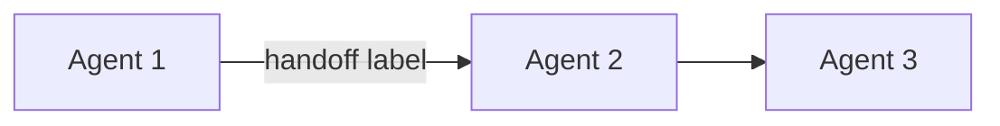

# SCE SDLC Playbook Generator

## Overview

Given a project context (or no context for org-wide playbook), this skill scans the agent and skill portfolio, maps capabilities to SDLC phases, and generates a structured playbook document. The playbook serves as a routing guide for project managers and teams, showing which agents to invoke at each SDLC phase.

This skill is read-only and generative: it reads agent/skill metadata and produces a playbook document. It does NOT modify agents or skills.

## When to Use

- A project manager needs to know which agents to use for a new project
- A team needs an overview of available AI agent capabilities across the SDLC
- Onboarding new team members to the agent-assisted SDLC workflow
- Generating a project-specific playbook filtered by tech stack and delivery surface
- Auditing SDLC phase coverage for capability gaps

## When NOT to Use

- Building or modifying agents/skills (use the AI Agent Builder agent)
- Analyzing agent/skill structure or quality (use `sce-agent-skill-analyzer`)
- Executing SDLC phases (invoke the agents directly)

## Inputs

```json
{
  "scope": "org-wide|project-specific",
  "project_context": {
    "project_name": "string (optional, for project-specific playbook)",
    "tech_stack": "react_node_ts_js|python|dotnet|swift|java (optional, filters agents)",
    "delivery_surface": "spa|webapp|mobile|windows_app|ai_voice (optional, filters agents)",
    "phases_included": ["1","2","3","4","5","6","7"] 
  },
  "output_format": "markdown|json|both",
  "output_path": "docs/playbook/ (default)"
}
```

### Input Defaults
- `scope`: `org-wide` (generates full portfolio playbook)
- `phases_included`: all phases (1-7 + meta)
- `output_format`: `both` (JSON canonical + Markdown companion)
- `output_path`: `docs/playbook/`

## Workflow

### Step 1: Scan Agent Portfolio

Scan `.github/agents/*.agent.md` files and extract:
- Agent name (from frontmatter `name` field)
- Description (from frontmatter `description` field)
- SDLC phase (parsed from name: "N - Phase Name - Agent Title")
- Tools used
- Handoffs defined (which agents it connects to)
- Model configuration

Use glob pattern: `.github/agents/*.agent.md`

### Step 2: Scan Skill Portfolio

Scan `.github/skills/*/` directories and extract from each `SKILL.md`:
- Skill name (from frontmatter `name` field)
- Description (from frontmatter `description` field)
- Category (from directory path or metadata)
- Tools used (from metadata.tools)
- Compatibility (which agents invoke this skill)

Use glob pattern: `.github/skills/*/*/SKILL.md`

### Step 3: Map to SDLC Phases

Group agents by their SDLC phase number:

| Phase | Name | Focus |
|-------|------|-------|
| 1 | Strategy & Planning | Architecture decisions, standards, agent building |
| 2 | Idea & Demand | Requirements gathering, PRDs, stakeholder engagement |
| 3 | Analysis | Requirements analysis, gap detection, quality scoring |
| 4 | Design | Architecture documents, solution design |
| 5 | Test & Build | Implementation, testing, DevOps, quality assurance |
| 6 | Change & Release | Deployment, CI/CD, release management |
| 7 | Operate & Support | Operations, incident response, knowledge management |
| Meta | Cross-Cutting | Critique, refinement, utility agents |

For each phase, list:
- Available agents with their descriptions
- Recommended invocation order (based on handoff chains)
- Required skills per agent
- Decision points (which agent to start with)

### Step 4: Apply Filters (if project-specific)

If `scope` is `project-specific`:
- Filter agents by tech stack relevance (e.g., only show Java Developer if stack is Java)
- Filter by delivery surface (e.g., hide Swift Developer for webapp projects)
- Highlight the recommended agent path for this project type

### Step 5: Generate Playbook

Produce the playbook in the requested output format(s).

## Output Schema (JSON)

```json
{
  "generated_by": {
    "skill": "sce-sdlc-playbook-generator",
    "version": "1.0.0"
  },
  "playbook": {
    "title": "SDLC Agent Playbook",
    "scope": "org-wide|project-specific",
    "project_name": "string or null",
    "generated_date": "ISO-8601",
    "agent_count": 0,
    "skill_count": 0,
    "phases": [
      {
        "phase_number": 1,
        "phase_name": "Strategy & Planning",
        "description": "Phase focus description",
        "agents": [
          {
            "name": "agent name from frontmatter",
            "description": "agent description",
            "model": "model configuration",
            "tools": ["tool list"],
            "handoffs_to": ["agents this hands off to"],
            "invoked_by": ["agents that invoke this one"],
            "skills_used": ["skills this agent invokes"],
            "when_to_use": "routing guidance"
          }
        ],
        "recommended_flow": "Description of typical workflow through this phase",
        "entry_points": ["agents that start this phase"],
        "exit_points": ["agents that hand off to next phase"]
      }
    ],
    "skill_catalog": [
      {
        "category": "security",
        "skills": [
          {
            "name": "skill name",
            "description": "skill description",
            "used_by_agents": ["agents that invoke this skill"]
          }
        ]
      }
    ],
    "handoff_map": {
      "description": "Complete handoff graph showing agent-to-agent connections",
      "edges": [
        {
          "from": "source agent",
          "to": "target agent",
          "trigger": "handoff label/condition"
        }
      ]
    },
    "coverage_gaps": [
      {
        "phase": 7,
        "gap": "description of what is missing",
        "recommendation": "what to build"
      }
    ]
  }
}
```

## Output Template (Markdown Companion)

```markdown
# SDLC Agent Playbook

**Scope:** {org-wide | project-specific for {project_name}}
**Generated:** {date}
**Agents:** {count} | **Skills:** {count}

---

## Phase 1: Strategy & Planning

**Focus:** Architecture decisions, standards governance, capability building

| Agent | Description | Start Here? |
|-------|-------------|-------------|
| {name} | {description} | {Yes/No} |

**Recommended Flow:**
{description of typical workflow through this phase}

**Entry Points:** {agents to start with}
**Hands Off To:** {next phase agents}

---

## Phase 2: Idea & Demand
...

## Skill Catalog

### Security ({count} skills)
| Skill | Description | Used By |
|-------|-------------|---------|
| {name} | {description} | {agent list} |

### DevOps ({count} skills)
...

## Handoff Map



## Coverage Gaps

| Phase | Gap | Recommendation |
|-------|-----|----------------|
| {N} | {description} | {what to build} |
```

## Error Handling

- If no agents found in `.github/agents/`, report empty portfolio
- If agent frontmatter is malformed, skip that agent and note it in `coverage_gaps`
- If a skill directory exists but has no `SKILL.md`, skip and note in output
- If `scope` is `project-specific` but no `tech_stack` provided, generate full playbook with a note

## Standards Compliance

### Artifact Output Standard
All outputs MUST have a canonical JSON representation. The Markdown companion is REQUIRED when output_format includes markdown.

### Confidence Standard
Do NOT output heuristic confidence labels. If logprobs are unavailable, set `logprobs_available: false` and mark result as `needs_review`.

### Standards References
- `docs/standards/CONTEXT_PASSING_STANDARDS.md`
- `docs/standards/TECH_STACK_STANDARDS.md`
- `docs/standards/tech-policy-matrix.yaml`
