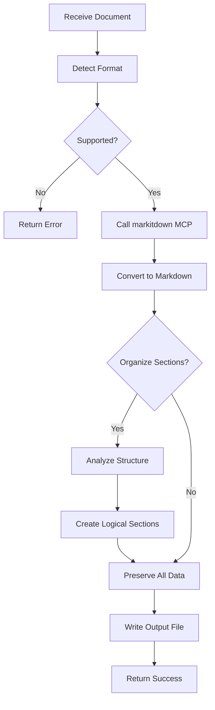

# SCE Document Markdown Converter

Converts documents from various formats into well-structured markdown files for agent consumption.

## When to Use This Skill

- Converting PDFs to markdown for analysis
- Processing Word documents into structured text
- Extracting data from Excel/CSV into markdown tables
- Converting PowerPoint presentations into readable format
- Processing images with text (OCR) into markdown
- Ingesting HTML/web content as markdown
- Preparing external documentation for agent processing
- Standardizing knowledge bases into markdown format

## Unitary Function

**ONE RESPONSIBILITY:** Convert document formats to well-structured markdown with intelligent section organization

**NOT RESPONSIBLE FOR:**
- Document metadata extraction (see sce-document-osint)
- Document summarization (that's agent's responsibility)
- Document validation or compliance checking
- Document security scanning (see security skills)
- Content generation or rewriting

## Supported Formats

**Documents:**
- PDF (`.pdf`)
- Microsoft Word (`.docx`, `.doc`)
- Microsoft Excel (`.xlsx`, `.xls`, `.csv`)
- Microsoft PowerPoint (`.pptx`, `.ppt`)

**Web & Markup:**
- HTML (`.html`, `.htm`)
- XML (`.xml`)
- RSS/Atom feeds

**Images (with OCR):**
- JPEG (`.jpg`, `.jpeg`)
- PNG (`.png`)
- GIF (`.gif`)
- TIFF (`.tiff`)

**Other:**
- Plain text (`.txt`)
- Rich Text Format (`.rtf`)
- ZIP archives (extracts and processes contents)

## Input

**Required:**
- **file_path**: Absolute path to document file to convert

**Optional:**
- **output_path**: Custom output path for markdown file (default: same directory with `.md` extension)
- **organize_sections**: Boolean to enable intelligent section reorganization (default: true)
- **preserve_formatting**: Boolean to maintain original formatting details (default: true)
- **extract_images**: Boolean to extract embedded images as separate files (default: false)

**Example:**
```json
{
  "file_path": "/path/to/document.pdf",
  "output_path": "/path/to/output.md",
  "organize_sections": true,
  "preserve_formatting": true
}
```

## Output

**Success:**
```json
{
  "status": "success",
  "conversion_id": "CONV-uuid",
  "source_file": "/path/to/document.pdf",
  "output_file": "/path/to/output.md",
  "format_detected": "PDF",
  "sections_created": 12,
  "markdown_preview": "# Document Title\n\n## Section 1...",
  "metadata": {
    "original_size": "2.4 MB",
    "markdown_size": "145 KB",
    "pages_processed": 50,
    "images_extracted": 3,
    "tables_converted": 7
  },
  "warnings": []
}
```

**Partial Success (with warnings):**
```json
{
  "status": "partial_success",
  "conversion_id": "CONV-uuid",
  "output_file": "/path/to/output.md",
  "warnings": [
    "Page 5: Complex table formatting simplified",
    "Page 12: Embedded chart converted to description"
  ],
  "data_loss": false
}
```

**Error:**
```json
{
  "status": "error",
  "error_type": "UnsupportedFormat | FileNotFound | PermissionDenied | ConversionFailed",
  "message": "Detailed error message",
  "fallback_available": true,
  "suggestions": ["Try extracting as text", "Check file permissions"]
}
```

## Process Flow



## Implementation

### Setup Requirements

1. **MCP Server Configuration**: Ensure markitdown MCP server is configured in VS Code settings:
   ```json
   {
     "mcp.servers": {
       "markitdown": {
         "command": "uvx",
         "args": ["markitdown"]
       }
     }
   }
   ```

2. **Tool Access**: Skill requires access to:
   - `read` - Read input documents
   - `search` - Find document files
   - `edit` - Write markdown output
   - MCP server (markitdown)

### Core Conversion Logic

**Step 1: Validate Input**
```bash
# Check file exists and is readable
if [ ! -f "$file_path" ]; then
    echo "Error: File not found"
    exit 1
fi

# Detect file format
file_type=$(file -b --mime-type "$file_path")
extension="${file_path##*.}"
```

**Step 2: Call markitdown MCP Server**
```python
# MCP server handles conversion
# Example invocation (pseudo-code, actual MCP call handled by VS Code)
result = mcp_markitdown.convert({
    "file_path": file_path,
    "output_format": "markdown"
})
```

**Step 3: Organize Content (if enabled)**
```bash
# Analyze markdown structure
# Identify logical sections based on:
# - Heading hierarchy
# - Content patterns (intro, body, conclusion)
# - Table of contents if present
# - Document metadata

# Reorganize while preserving:
# - All original content (no data loss)
# - Heading relationships
# - List structures
# - Table data
# - Code blocks
# - Links and references
```

**Step 4: Write Output**
```bash
# Write organized markdown to output file
cat > "$output_path" << 'EOF'
$organized_markdown_content
EOF

# Verify no data loss
original_word_count=$(wc -w < input_extracted)
output_word_count=$(wc -w < "$output_path")
# Flag if significant discrepancy
```

### Section Organization Strategy

When `organize_sections: true`, skill applies intelligent restructuring:

1. **Title Extraction**: Identify main document title
2. **Heading Normalization**: Ensure proper heading hierarchy (H1 → H2 → H3)
3. **Section Grouping**: Group related content under logical sections
4. **Table of Contents**: Generate TOC for documents >5 sections
5. **Metadata Section**: Add document info at top if available
6. **Footer Content**: Move references/bibliography to end

**Example Transformation:**
```markdown
# BEFORE (raw conversion)
Document Title
Introduction text here
SECTION A
Content A
SubSection A.1
More content
SECTION B
Content B

# AFTER (organized)
# Document Title

## Overview
Introduction text here

## Section A
Content A

### SubSection A.1
More content

## Section B
Content B
```

## Error Handling

### Conversion Failures

**Strategy: Graceful degradation with multiple fallback options**

1. **Primary**: markitdown MCP server conversion
2. **Fallback 1**: Text extraction only (no formatting)
3. **Fallback 2**: Return error with file contents as code block
4. **Fallback 3**: Return structured error with manual guidance

```bash
# Pseudo-code error handling
try_conversion() {
    result=$(mcp_markitdown.convert "$file_path") || {
        # Fallback to text extraction
        result=$(extract_text_only "$file_path") || {
            # Return helpful error
            return_error_with_suggestions
        }
    }
}
```

### Partial Conversion

Some content may not convert perfectly:
- **Complex tables**: Simplified to basic markdown tables
- **Charts/graphs**: Converted to descriptive text
- **Embedded objects**: Noted as [Embedded Object: type]
- **Special fonts/formatting**: Preserved as bold/italic approximations

**All partial conversions are flagged in warnings array.**

## Quality Checks

**Before returning success, MUST verify:**
- [ ] Output file created and readable
- [ ] Output file contains content (not empty)
- [ ] No significant data loss (content comparison)
- [ ] Markdown syntax valid (no broken formatting)
- [ ] All tables converted (even if simplified)
- [ ] All images handled (extracted or noted)
- [ ] Warnings documented for any approximations

## Usage Examples

### Example 1: Convert PDF Report
```json
{
  "file_path": "/docs/quarterly-report.pdf",
  "organize_sections": true
}
```

**Output:** `/docs/quarterly-report.md` with organized sections

### Example 2: Convert Excel Data
```json
{
  "file_path": "/data/metrics.xlsx",
  "output_path": "/data/metrics-converted.md",
  "preserve_formatting": true
}
```

**Output:** Markdown with data tables

### Example 3: Convert Word Document with Images
```json
{
  "file_path": "/specs/design-spec.docx",
  "extract_images": true,
  "organize_sections": true
}
```

**Output:** 
- `/specs/design-spec.md` (main content)
- `/specs/design-spec-images/` (extracted images folder)

## Integration with Other Skills

**Complements:**
- **sce-document-osint**: Use after conversion to extract metadata
- **sce-codebase-analyzer**: Feed converted docs for analysis
- **sce-prd-generator**: Convert existing specs to markdown for PRD generation

**Used By:**
- All agents that need to read external documents
- Knowledge ingestion pipelines
- Documentation processing workflows

## Performance Considerations

**Typical Conversion Times:**
- Small PDF (1-10 pages): 2-5 seconds
- Medium document (10-50 pages): 5-15 seconds
- Large document (50-200 pages): 15-45 seconds
- Excel with complex sheets: 10-30 seconds

**Resource Usage:**
- Memory: Proportional to document size
- Disk: Output typically 10-30% of original size

## Limitations

**Known Limitations:**
- Very large files (>100MB) may timeout
- Password-protected documents not supported
- Handwritten content recognition quality varies
- Complex mathematical equations may not render perfectly
- Embedded videos/audio noted but not extracted

**Workarounds:**
- Split large documents before conversion
- Remove password protection before processing
- For equations, consider re-typing in LaTeX

## Verification Mechanism

**Skill MUST verify before returning success:**
1. File conversion completed without critical errors
2. Output file exists and is non-empty
3. Content preserved (word count within 5% tolerance)
4. Markdown syntax valid (no unclosed tags/blocks)
5. All warnings documented and categorized

## Standards Compliance

✓ Follows Agent Skills Specification (agentskills.io)
✓ Single responsibility (conversion only)
✓ Clear input/output contracts
✓ Deterministic error handling
✓ Comprehensive documentation
✓ Integration-ready with existing portfolio

---

**Version History:**
- 1.0.0 (2026-01-20): Initial release with markitdown MCP server integration
