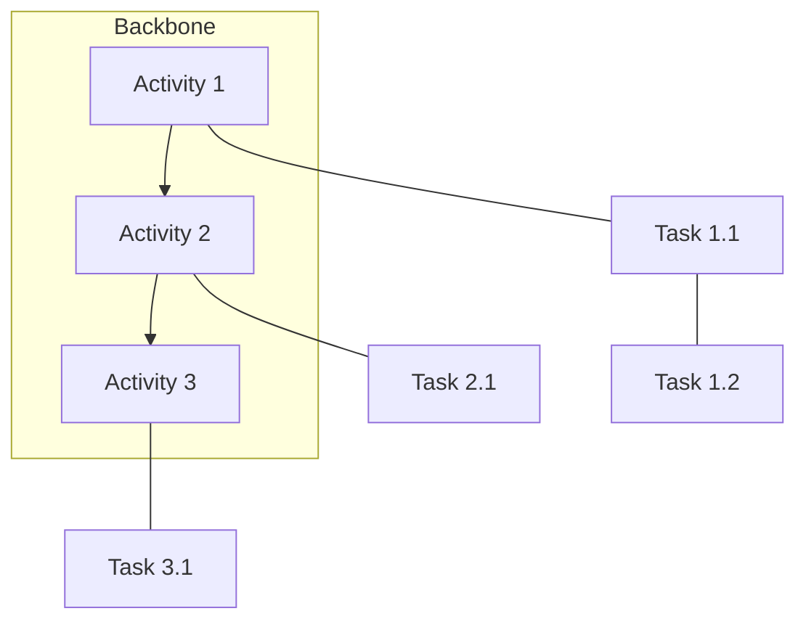

# User Story Mapping Techniques

Detailed techniques for creating effective story maps.

## Backbone Discovery Techniques

### Big Picture Mapping

Start with the complete user experience:

```yaml
steps:
  1. Frame the experience:
     question: "What is the user trying to accomplish overall?"
     output: "High-level goal (e.g., 'Purchase a product online')"

  2. Identify major activities:
     question: "What are the big things users do to reach that goal?"
     technique: "Walk through the journey out loud"
     output: "5-10 backbone activities"

  3. Order left-to-right:
     principle: "Time flows left to right"
     output: "Sequenced backbone"

  4. Validate completeness:
     question: "Can a user achieve their goal with these activities?"
```

### Story Workshop Technique

Collaborative session format:

```yaml
workshop_structure:
  duration: "2-4 hours"
  participants:
    - Product Owner
    - Development Team
    - UX Designer
    - Customer representative (optional)

  materials:
    - Large wall or whiteboard
    - Sticky notes (3 colors minimum)
    - Markers
    - Tape for release lines

  phases:
    1. Frame (15 min):
       - Define the user
       - State the goal
       - Set scope boundaries

    2. Map backbone (30 min):
       - Each person writes activities on yellow stickies
       - Group and deduplicate
       - Arrange left-to-right

    3. Fill tasks (60 min):
       - Blue stickies for user tasks
       - Place under relevant activity
       - Vertical = priority

    4. Walk the skeleton (30 min):
       - Draw line for minimum path
       - Debate what's truly minimum
       - Resolve by "can user complete goal?"

    5. Slice releases (45 min):
       - Draw horizontal release lines
       - Name each release
       - Validate user value per release
```

## Task Breakdown Patterns

### The 3 Levels

```text
Level 1: Backbone (Activities)
├── Level 2: User Tasks (Stories)
│   └── Level 3: Sub-tasks (Technical)
```

**Focus on Level 1 and 2 during mapping.**

### INVEST for Story Quality

Stories under each activity should be:

| Criterion | Check |
| --------- | ----- |
| **Independent** | Can be built without other stories (mostly) |
| **Negotiable** | Details can be discussed |
| **Valuable** | Delivers user value |
| **Estimable** | Team can size it |
| **Small** | Fits in a sprint |
| **Testable** | Clear acceptance criteria |

## Walking Skeleton Patterns

### Tracer Bullet Approach

```yaml
tracer_bullet:
  definition: "End-to-end path through all architectural layers"

  example_ecommerce:
    - "User can search for 'shoes'"
    - "System returns list of results"
    - "User can add one item to cart"
    - "User can checkout with test payment"
    - "Order appears in admin system"

  properties:
    - Touches all major components
    - Proves integration works
    - Foundation for enhancement
    - Deployable and testable
```

### Minimum Viable Path

```yaml
mvp_questions:
  - "What's the simplest way a user could complete this activity?"
  - "What can we remove and still have a working feature?"
  - "Would a user pay for just this?"

mvp_antipatterns:
  - "We need the admin panel first" (no user value)
  - "Let's include all the edge cases" (not minimum)
  - "Users expect X" (validate assumption first)
```

## Multi-Persona Mapping

When different users have different journeys:

```yaml
multi_persona_approach:
  option_1_layers:
    description: "Stack personas as horizontal bands"
    example:
      top_band: "Power User journey"
      middle_band: "Regular User journey"
      bottom_band: "Admin journey"

  option_2_separate_maps:
    description: "Create separate maps per persona"
    when: "Journeys are very different"

  option_3_branching:
    description: "Single backbone with persona-specific branches"
    when: "Core journey is similar, details differ"
```

## Digital Mapping Tools

### Mermaid (CLI-friendly)



### YAML Format (Machine-readable)

```yaml
story_map:
  backbone:
    - id: A1
      name: Activity 1
      tasks:
        - id: T1.1
          name: Task 1.1
          release: mvp
        - id: T1.2
          name: Task 1.2
          release: r1
```

## Common Mapping Mistakes

### Mistake 1: Tech-First Organization

```text
Wrong:
├── API Development
├── Database Design
├── UI Components
└── Testing

Right:
├── User Registration
├── Product Search
├── Checkout
└── Order Tracking
```

### Mistake 2: Missing the Backbone

Going straight to stories without establishing activities:

```text
Wrong: "Let's list all the user stories"
Right: "What activities does the user perform?"
```

### Mistake 3: Over-Detailed Initial Map

```text
Wrong: 200 sticky notes on first session
Right: 30-50 stories max, add detail iteratively
```

### Mistake 4: Release by Effort, Not Value

```text
Wrong: "Release 1 = easy stuff"
Right: "Release 1 = minimum user value"
```
