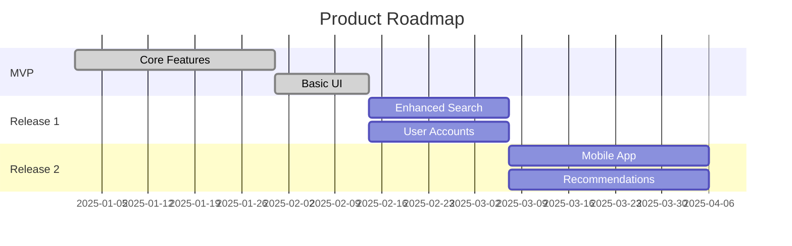

# Release Planning with Story Maps

Strategies for slicing story maps into valuable releases.

## Release Slicing Principles

### Slice Horizontally, Not Vertically

```text
WRONG (Vertical):
Release 1: Complete "Search" activity
Release 2: Complete "Browse" activity
Release 3: Complete "Purchase" activity

RIGHT (Horizontal):
Release 1: Basic Search + Basic Browse + Basic Purchase
Release 2: Enhanced Search + Enhanced Browse + Enhanced Purchase
```

**Why horizontal?** Each release delivers end-to-end user value.

### The "Now, Next, Later" Pattern

```yaml
slicing_pattern:
  now_mvp:
    principle: "What must we ship first?"
    criteria:
      - Validates core hypothesis
      - Smallest thing that's useful
      - Walking skeleton + minimal polish

  next_r1:
    principle: "What do we learn from MVP feedback?"
    criteria:
      - Addresses MVP pain points
      - Adds most-requested features
      - Improves key workflows

  later:
    principle: "Everything else"
    criteria:
      - Nice-to-have features
      - Edge cases
      - Future vision items
```

## MVP Definition Techniques

### Minimum Viable Product Criteria

```yaml
mvp_must_be:
  viable:
    - "User can complete their goal"
    - "Quality sufficient for real use"
    - "Doesn't embarrass the brand"

  minimum:
    - "Nothing can be removed"
    - "Every feature is essential"
    - "Validated through user research"

  product:
    - "Complete enough to sell/deploy"
    - "Not a demo or prototype"
    - "Foundation for future releases"
```

### MVP Discovery Questions

```yaml
questions:
  1. "If we only had 2 weeks, what would we ship?"
  2. "What's the one thing users MUST be able to do?"
  3. "What can we learn only by shipping?"
  4. "What's the riskiest assumption to validate?"
```

### MVP Antipatterns

| Antipattern | Problem | Solution |
| ----------- | ------- | -------- |
| "One more feature" | Scope creep | Time-box decisions |
| Invisible MVP | Only backend work | Include user-facing value |
| Perfect MVP | Over-polished | Ship and learn |
| Compromised MVP | Too few features to be useful | Find the minimum viable path |

## Release Sizing

### Right-Sized Releases

```yaml
release_size_guidelines:
  too_small:
    symptoms:
      - "No user value on its own"
      - "Requires next release to be useful"
    fix: "Combine with next release"

  too_large:
    symptoms:
      - "More than 3 months of work"
      - "Hard to describe value simply"
    fix: "Split horizontally"

  just_right:
    properties:
      - 2-8 weeks of work
      - Clear user value statement
      - Demonstrable in 5 minutes
      - Feedback-worthy
```

### Release Naming

```yaml
naming_conventions:
  good_names:
    - "Launch MVP" (action-oriented)
    - "Mobile Experience" (feature-focused)
    - "Speed Improvements" (outcome-focused)

  bad_names:
    - "Phase 1" (no meaning)
    - "Sprint 5-10 output" (process-focused)
    - "Backend Refactor" (tech-focused)
```

## Value Validation

### Story Points vs User Value

```yaml
prioritization_matrix:
  high_value_low_effort:
    action: "Do first"
    in_release: "MVP"

  high_value_high_effort:
    action: "Split if possible"
    in_release: "Plan carefully"

  low_value_low_effort:
    action: "Quick wins after MVP"
    in_release: "R1 or R2"

  low_value_high_effort:
    action: "Question necessity"
    in_release: "Maybe never"
```

### Release Value Statement

Each release should have a clear value statement:

```yaml
release_value_template:
  format: "This release enables [user] to [action] so they can [benefit]"

  examples:
    mvp: "This release enables shoppers to find and purchase products so they can buy from us online."
    r1: "This release enables shoppers to filter and compare products so they can find the best option faster."
    r2: "This release enables shoppers to save favorites and track orders so they can shop more efficiently."
```

## Dependencies Management

### Identifying Dependencies

```yaml
dependency_types:
  technical:
    example: "API must exist before UI"
    strategy: "Include in walking skeleton"

  business:
    example: "Payment integration before checkout"
    strategy: "Sequence releases appropriately"

  external:
    example: "Third-party API availability"
    strategy: "Build adapter/mock first"
```

### Handling Dependencies in Releases

```yaml
strategies:
  front_load:
    description: "Build foundational pieces first"
    use_when: "Dependencies are well understood"

  stub_and_replace:
    description: "Mock dependencies, replace later"
    use_when: "Dependency is blocking but uncertain"

  defer:
    description: "Push dependent feature to later release"
    use_when: "Feature isn't critical for MVP"
```

## Communicating Releases

### Roadmap Visualization



### Stakeholder Communication

```yaml
communication_template:
  for_executives:
    focus: "Value delivered, timeline, risks"
    format: "1-page roadmap with milestones"

  for_team:
    focus: "Stories, dependencies, acceptance criteria"
    format: "Detailed story map"

  for_customers:
    focus: "What's coming, when, why it matters"
    format: "Feature announcements, beta invites"
```

## Iterating the Plan

### When to Re-Slice

```yaml
re_slicing_triggers:
  - "Learned something that changes priorities"
  - "External event changes timeline"
  - "Technical discovery reveals new constraints"
  - "User feedback contradicts assumptions"
```

### Continuous Mapping

```yaml
continuous_practices:
  weekly:
    - "Review upcoming release scope"
    - "Update estimates if needed"

  per_release:
    - "Retrospective on predictions vs reality"
    - "Adjust future release scope"

  quarterly:
    - "Full map review with stakeholders"
    - "Major re-prioritization if needed"
```
