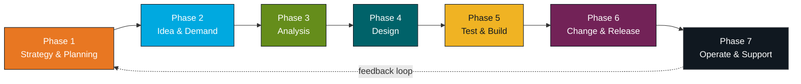
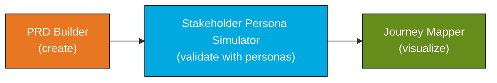
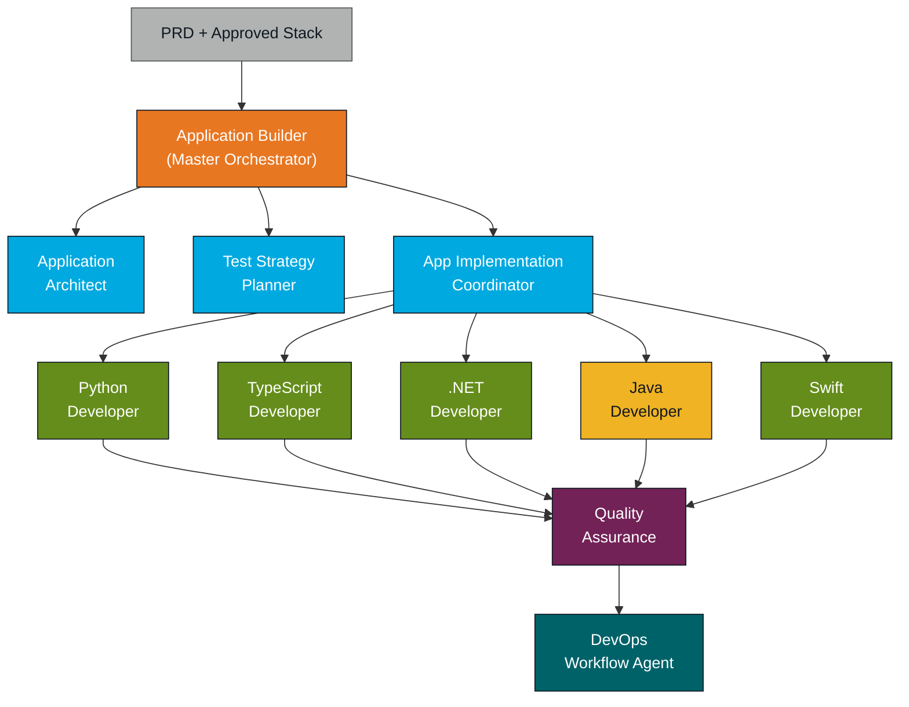
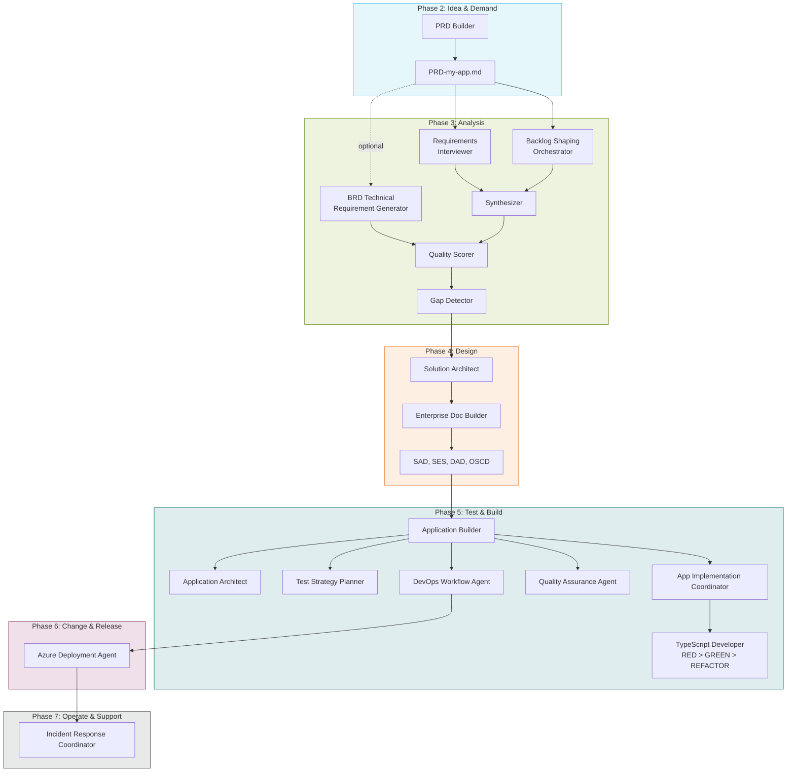
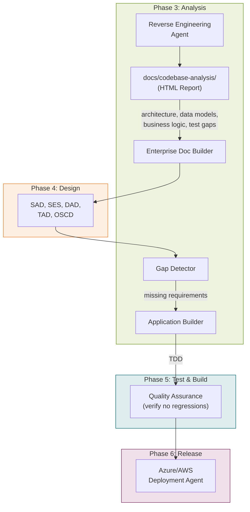
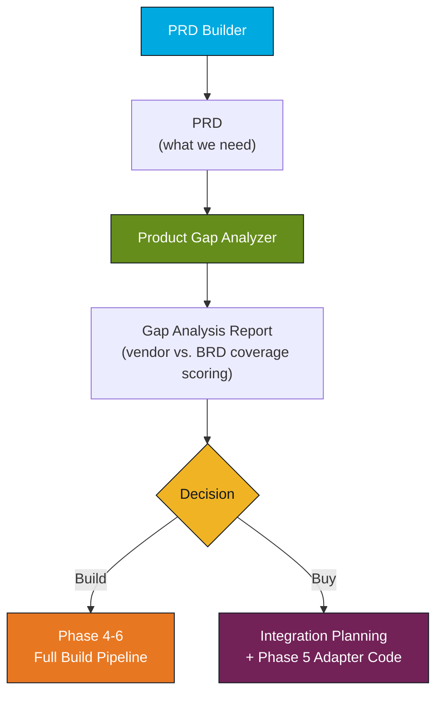
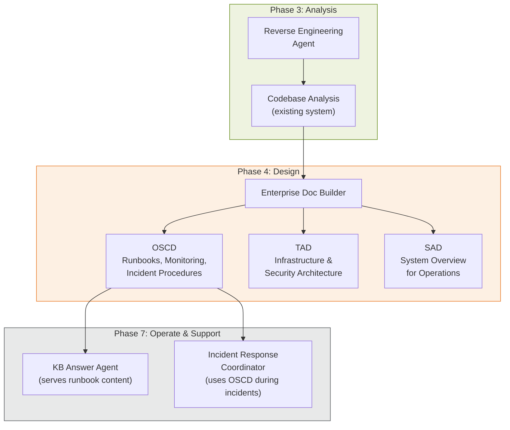

# SCE AI-Assisted SDLC Playbook

**Version:** 1.0.0 | **Date:** March 11, 2026 | **Owner:** Enterprise Architecture Team | **Status:** Active
**Audience:** Development Project Managers, Tech Leads, Engineering Teams

---

## What This Playbook Is

This playbook helps you navigate the full Software Development Lifecycle using the AI agents and skills in this repository. For each phase, you will find which agent to call, when to call it, and what it produces. Think of it as a routing guide that takes you from ideation all the way through to production operations.

**Portfolio:** 38 agents | 78 skills | 7 SDLC phases | 4 approved tech stacks | 5 delivery surfaces

---

## Quick Reference: "I need to..."

| I need to...                                             | Start here | Agent                                     |
|----------------------------------------------------------|------------|-------------------------------------------|
| Write a PRD for a new product idea                       | Phase 2    | `2 - Product PRD Builder`                 |
| Shape rough ideas into backlog-ready work                | Phase 3    | `3 - Backlog Shaping Orchestrator`        |
| Derive technical requirements from a BRD                 | Phase 3    | `3 - BRD Technical Requirement Generator` |
| Understand an existing codebase                          | Phase 3    | `3 - Reverse Engineering Agent`           |
| Evaluate a vendor product against requirements           | Phase 3    | `3 - Product Gap Analyzer`                |
| Create an ADR by hand                                    | Phase 4    | `4 - ADR Builder`                         |
| Document a non-standard technology as ABB plus SBBs      | Phase 4    | `4 - Universal Building Block Builder`    |
| Generate architecture documents (SAD, SES, etc.)         | Phase 4    | `4 - Enterprise Doc Builder`              |
| Build an application from a PRD end-to-end               | Phase 5    | `5 - Application Builder`                 |
| Implement a feature in Python / TS / .NET / Java / Swift | Phase 5    | `5 - App Implementation Coordinator`      |
| Set up CI/CD pipelines                                   | Phase 5    | `5 - DevOps Workflow Agent`               |
| Deploy to Azure or AWS                                   | Phase 6    | `6 - Azure/AWS Deployment Agent`          |
| Triage a production incident                             | Phase 7    | `7 - Incident Response Coordinator`       |
| Find an answer in the Knowledge Base                     | Phase 7    | `7 - KB Answer Agent`                     |

---

## Tech Stack Decision Guide

Before starting development, identify your **delivery surface** and match it to an **approved stack**. This determines which developer agent will be routed to.

### Approved Stacks (tech-policy-matrix v3.1.0)

| Stack                    | Languages                    | Frameworks                               | Best For                                                                                |
|--------------------------|------------------------------|------------------------------------------|-----------------------------------------------------------------------------------------|
| **React + Node + TS/JS** | TypeScript 5.0+, Node.js 18+ | React 18+, NestJS, Express, React Native | SPAs, full-stack web, cross-platform mobile                                             |
| **Python**               | Python 3.11+                 | FastAPI, Django, Flask                   | Backend APIs, data/ML, automation, AI/Voice                                             |
| **.NET**                 | C# 12+, .NET 10+             | ASP.NET Core, Blazor, WPF, WinUI 3       | Windows apps, enterprise web APIs                                                       |
| **Swift**                | Swift 5.9+                   | SwiftUI, UIKit                           | Native iOS/macOS apps                                                                   |
| **Java** *(secondary)*   | Java 17+ LTS                 | Spring Boot 3.x, Quarkus 3.x             | Legacy maintenance, high-concurrency (requires approval + migration plan by 2026-12-31) |

### Stack × Surface Matrix

| Delivery Surface             | Preferred Stack      | Allowed Alternatives | Developer Agent                        |
|------------------------------|----------------------|----------------------|----------------------------------------|
| **SPA** (Single Page App)    | React + Node + TS/JS | None                 | TypeScript Developer                   |
| **WebApp** (Server-rendered) | React + Node + TS/JS | Python, .NET         | TypeScript / Python / DotNet Developer |
| **Mobile**                   | React Native (TS/JS) | Swift (native iOS)   | TypeScript / Swift Developer           |
| **Windows App**              | .NET (WPF/WinUI 3)   | None                 | DotNet Developer                       |
| **AI / Voice**               | Python               | React + Node + TS/JS | Python / TypeScript Developer          |

### When Java Is Involved

Java is a **secondary language with a deprecation timeline** (2026-12-31). The Java Developer agent enforces a governance gate requiring:

1. Architecture approval documented in an ADR
2. A migration plan to an approved stack
3. Valid justification (legacy maintenance, ecosystem integration, high-concurrency)

---

## The 7-Phase SDLC Journey



---

## Phase 1: Strategy & Planning

**Purpose:** Establish governance standards and build new agent/skill capabilities when gaps are identified.

| Agent                      | What It Does                                                                                                                         | When to Use                                                                       | Key Output                                                 |
|----------------------------|--------------------------------------------------------------------------------------------------------------------------------------|-----------------------------------------------------------------------------------|------------------------------------------------------------|
| **AI Agent Builder**       | Analyzes capability requests and recommends whether to reuse, adapt, compose, or create using a 4-tier cascade                       | Before building any new agent or skill, to make sure you are not duplicating work | Specification (SKILL.md or AGENT.md) with approval package |
| **Standards Gap Analyzer** | Ingests standards documents (any format), identifies gaps against `tech-policy-matrix.yaml`, and updates the YAML after confirmation | When new security, compliance, or technology standards are published              | Updated `tech-policy-matrix.yaml` with versioned changes   |

**PM Action Items:**

- Before any new capability development, route through the AI Agent Builder
- When new enterprise standards arrive, run the Standards Gap Analyzer to update the policy matrix

---

## Phase 2: Idea & Demand

**Purpose:** Capture, simulate, and document product requirements before analysis begins.

| Agent                             | What It Does                                                                                                                                      | When to Use                                                                           | Key Output                                                 |
|-----------------------------------|---------------------------------------------------------------------------------------------------------------------------------------------------|---------------------------------------------------------------------------------------|------------------------------------------------------------|
| **Product PRD Builder**           | Walks you through interactive PRD creation by asking clarifying questions, generating a full PRD, and supporting iterative reruns to resolve TBDs | Starting a new product or feature initiative                                          | `docs/PRD/PRD-{product-name}.md`                           |
| **Stakeholder Persona Simulator** | Simulates stakeholder perspectives (business, compliance, end-user, operations, technical) for requirements elicitation                           | When real stakeholders are unavailable for interviews, or to stress-test requirements | Simulated stakeholder responses and concerns               |
| **Journey Mapper**                | Creates customer journey maps with emotional curves, pain points, and opportunity identification                                                  | After initial requirements are gathered, to visualize the user experience end-to-end  | Mermaid journey diagrams with pain/opportunity annotations |

**Typical Flow:**



**PM Action Items:**

- Start every project with a PRD. It feeds into all downstream agents
- Use the Persona Simulator to catch blind spots before real stakeholder reviews
- Journey maps work well for stakeholder presentations and alignment

---

## Phase 3: Analysis

**Purpose:** Deep requirements analysis. This is where you extract, interview, synthesize, score, and detect gaps. You can also reverse-engineer existing codebases here.

- **Requirements Interviewer**: Conducts AI-led structured stakeholder interviews using research-backed questioning patterns. Use when eliciting requirements from stakeholders. Output: interview transcripts with extracted requirements.
- **Document Miner**: Extracts requirements from PDFs, specs, meeting transcripts, and web content. Use when requirements are buried in existing documents. Output: extracted requirement candidates with source references.
- **Backlog Shaping Orchestrator**: Turns rough product, business, and engineering inputs into backlog-ready stories, requirements, spikes, and release slices. Use when demand is too vague, too large, or too mixed for engineering handoff. Output: backlog shaping package with normalized items, slice plan, open questions, and recommended next steps.
- **BRD Technical Requirement Generator**: Converts Business Requirements Documents into traceable, system-centric technical requirements by orchestrating extraction, normalization, coverage checks, and quality review. Use when business requirements are captured but engineering-ready technical requirements are still implicit. Output: technical requirement set with traceability, open questions, and readiness findings.
- **Requirements Synthesizer**: Consolidates requirements from multiple sources, resolves conflicts, and identifies patterns. Use after gathering from interviews, documents, and simulations. Output: unified requirement set (pre-canonical).
- **Quality Scorer**: Evaluates requirements against 6Cs (Clear, Concise, Complete, Consistent, Correct, Confirmable) and INVEST. Use before finalizing requirements as a quality gate. Output: quality scores per requirement with improvement suggestions.
- **Gap Detector**: Analyzes requirements for completeness using domain checklists, NFR categories, and INVEST. Use after synthesis to catch what is missing. Output: missing requirement candidates with elicitation technique recommendations.
- **Product Gap Analyzer**: Evaluates COTS or vendor products against a BRD. Use for build-vs-buy decisions. Output: gap analysis report with coverage scores per BRD requirement.
- **Reverse Engineering Agent**: Deconstructs any codebase through 8 phases into navigable HTML documentation. Use for understanding existing systems, onboarding, and change impact analysis. Output: `docs/codebase-analysis/` with HTML, Mermaid diagrams, ER diagrams, file indexes, and business logic maps.

### Reverse Engineering: The 8 Phases

This agent is critical for dev and test teams working with existing codebases:

| Phase                        | What Happens                                                              | Output                            |
|------------------------------|---------------------------------------------------------------------------|-----------------------------------|
| 1. Discovery                 | Detects languages, frameworks, dependencies, entry points                 | Master file checklist JSON        |
| 2. File Analysis             | Deep per-file analysis: classes, methods, imports, patterns               | Per-file analysis records         |
| 3. Data Model Extraction     | ORM entities, migrations, schemas                                         | ER diagrams (Mermaid)             |
| 4. User Flow Mapping         | Traces execution paths from entry points                                  | Sequence diagrams per user action |
| 5. Architecture Synthesis    | Reconstructs layered architecture and component relationships             | Architecture diagrams             |
| 6. Business Logic Derivation | Names business capabilities, extracts rules                               | Business capability map           |
| 7. Test Gap Analysis         | Inventories tests, estimates coverage, identifies untested critical paths | Test gap report                   |
| 8. HTML Report Generation    | Stitches all outputs into navigable HTML                                  | Searchable HTML documentation     |

**Skills used by Reverse Engineering:**

- `sce-codebase-analyzer` for language/framework detection
- `sce-config-detector` for configuration file identification
- `sce-dependency-scanner` for dependency cataloging and CVE detection
- `sce-file-deep-analyzer` for per-file deep analysis
- `sce-data-model-extractor` for ORM/schema extraction
- `sce-flow-mapper` for execution path tracing
- `sce-reverse-engineering-reporter` for HTML report generation

**PM Action Items:**

- When demand arrives as rough notes, mixed backlog ideas, or oversized epics, run Backlog Shaping Orchestrator before sending work to engineering
- When a BRD exists but engineering obligations are still implicit, run BRD Technical Requirement Generator before architecture or implementation planning
- For **greenfield projects**: Run Requirements Interviewer, then Document Miner, then Synthesizer, then Quality Scorer, then Gap Detector
- For **existing systems**: Run Reverse Engineering Agent first to understand the codebase, then feed output into Enterprise Doc Builder
- For **build vs. buy**: Run Product Gap Analyzer against BRD

---

## Phase 4: Design

**Purpose:** Architecture decisions and enterprise documentation generation.

- **ADR Builder**: Creates indexed Architecture Decision Records by clarifying one decision, capturing alternatives and rationale, and drafting the canonical ADR package. Use when a person needs to create or update an ADR directly. Output: indexed ADR package using the canonical ADR template.
- **Universal Building Block Builder**: Creates the standards-deviation building-block package for a technology that is not already approved in `TECH_STACK_STANDARDS.md` by drafting one governing `ABB` plus the candidate `SBB` set. Use when a person needs to document a proposed non-standard technology and the serious alternatives before ADR approval. Output: ABB plus SBB package using the canonical UBB template and default ABB or SBB output paths.
- **Solution Architect**: Analyzes PRDs, applies tech-policy-matrix standards, makes technology stack decisions, and generates architecture documentation. Use after requirements are finalized, to determine how to build it. Output: ARA, AVD, and tech stack decisions.
- **Enterprise Doc Builder**: Generates enterprise architecture documents from templates, standards, and codebase analysis. Use after architecture decisions, to create formal documentation for governance. Output: SAD, SES, DAD, TAD, BAD, OSCD, and AIAD documents.

### Enterprise Document Types

| Document | Full Name                             | Purpose                                                    | Who Needs It                                |
|----------|---------------------------------------|------------------------------------------------------------|---------------------------------------------|
| **BAD**  | Business Architecture Document        | Business capabilities, processes, org mapping              | Business stakeholders, PMs                  |
| **SAD**  | System Appreciation Document          | High-level system overview, interfaces, data flows         | Architecture review board, new team members |
| **TAD**  | Technical Architecture Document       | Infrastructure, networking, security architecture          | Platform/SRE teams, security reviewers      |
| **DAD**  | Detailed Architecture Document        | Component-level architecture with deployment views         | Development teams                           |
| **SES**  | System Engineering Specification      | Detailed technical spec for build teams                    | Developers, QA engineers                    |
| **OSCD** | Operational Support & Change Document | Runbooks, monitoring, incident response, change procedures | Operations teams, SRE                       |
| **AIAD** | AI Architecture Document              | AI/ML model architecture, data pipelines, ethical AI       | AI/ML teams                                 |

**Recommended generation order:** BAD, SAD, TAD, DAD, SES, AIAD, OSCD (each one builds on the previous)

The Enterprise Doc Builder can consume output from the Reverse Engineering Agent (Phase 3) to generate documentation for existing systems.

**PM Action Items:**

- When a single architecture decision needs to be documented directly, run ADR Builder
- When a proposed technology is not already approved in `TECH_STACK_STANDARDS.md`, run Universal Building Block Builder to create the governing `ABB` plus candidate `SBB` set before ADR approval
- After PRD is approved, route to Solution Architect for stack decisions
- Use Enterprise Doc Builder to generate governance-ready documentation
- For existing systems: Use the Reverse Engineering to Enterprise Doc Builder pipeline to generate docs from actual code

---

## Phase 5: Test & Build

**Purpose:** This is the core development phase, covering architecture, TDD planning, implementation, quality assurance, and DevOps pipeline setup.

This is the largest phase. It has 14 agents working together in an orchestrated workflow.

### The Build Pipeline



### Application Builder (Master Orchestrator)

The **Application Builder** is the single entry point for end-to-end development from a PRD. It runs 8 phases:

| Phase                   | What Happens                                              | Sub-Agent                      | Approval Gate?                  |
|-------------------------|-----------------------------------------------------------|--------------------------------|---------------------------------|
| 1. PRD Analysis         | Extract requirements, constraints, success metrics        | Self                           | Yes, user confirms requirements |
| 2. Tech Stack Selection | Apply standards to choose language/framework/DB           | Self                           | Yes, user approves or overrides |
| 3. Architecture Design  | Design structure, data models, APIs, security, deployment | Application Architect          | Yes, architecture review        |
| 4. Test Strategy & TDD  | Design test pyramid, create failing test templates        | Test Strategy Planner          | Yes, test plan review           |
| 5. Implementation       | Route to language-specific developers, TDD enforcement    | App Implementation Coordinator | No, iterative                   |
| 6. Quality Assurance    | Linting, SAST, test execution, coverage                   | Quality Assurance Agent        | Pass/fail gate                  |
| 7. DevOps Integration   | Generate CI/CD workflows                                  | DevOps Workflow Agent          | No                              |
| 8. Documentation        | Complete documentation package                            | Self                           | No                              |

### Language-Specific Developer Agents

Each developer agent follows the same TDD workflow: **RED > GREEN > REFACTOR**

| Agent                    | Language          | Frameworks                           | Test Framework    | Key Standards                                   |
|--------------------------|-------------------|--------------------------------------|-------------------|-------------------------------------------------|
| **Python Developer**     | Python 3.11+      | FastAPI, Django, Flask               | pytest            | PEP 8, Black, mypy strict                       |
| **TypeScript Developer** | TypeScript 5.0+   | React, Vue, Angular, NestJS, Express | Vitest / Jest     | ESLint, Prettier, strict mode                   |
| **DotNet Developer**     | C# 12+ / .NET 10+ | ASP.NET Core, Blazor, WPF, WinUI 3   | xUnit             | StyleCop, Roslyn analyzers                      |
| **Java Developer**       | Java 17+          | Spring Boot, Quarkus                 | JUnit 5 + Mockito | Google Java Style, SpotBugs *(governance gate)* |
| **Swift Developer**      | Swift 5.9+        | SwiftUI, UIKit                       | XCTest            | Xcode, SPM *(governance gate)*                  |

All developer agents invoke the `sce-tdd-template-generator` skill to generate failing test templates before implementation.

### Test Strategy Planner

Designs the complete test strategy before a single line of production code is written:

- **Test pyramid**: Unit (70%), Integration (20%), E2E (10%)
- **Coverage targets**: Unit ≥ 85%, Integration ≥ 70%, Critical paths 100% E2E
- **TDD templates**: Generates failing test stubs that guide implementation
- **Quality gates**: Pass/fail criteria, coverage thresholds, performance test requirements
- **Output**: `docs/testing/TEST_STRATEGY.md`

### Quality Assurance Agent

Runs 5 phases of automated quality checks:

| QA Phase                | What It Checks                          | Tools                                                           |
|-------------------------|-----------------------------------------|-----------------------------------------------------------------|
| 1. Linting & Formatting | Code style compliance                   | Black/ESLint/StyleCop + Prettier/dotnet format                  |
| 2. Type Checking        | Type safety                             | mypy / TypeScript compiler / Roslyn                             |
| 3. Security Scanning    | Vulnerabilities, SAST, secret detection | `sce-dependency-scanner`, `sce-vulnerability-scanner`, gitleaks |
| 4. Test Execution       | Unit + integration + E2E with coverage  | pytest / Vitest / xUnit                                         |
| 5. Code Quality         | Complexity, maintainability, dead code  | Cyclomatic complexity, maintainability index                    |

**Gate**: Zero critical/high security findings. Unit ≥ 85%, Integration ≥ 70%.

### DevOps Workflow Agent

Generates enterprise-compliant GitHub Actions CI/CD pipelines by orchestrating 10 specialized skills:

| Skill                                  | What It Generates                               |
|----------------------------------------|-------------------------------------------------|
| `sce-workflow-analyzer`                | Scans project to detect tech stack              |
| `sce-requirements-gatherer`            | Collects CI/CD preferences                      |
| `sce-build-workflow-generator`         | Build pipeline (compile, test, package)         |
| `sce-check-workflow-generator`         | Code quality checks (SonarQube, linting)        |
| `sce-deploy-workflow-generator`        | Deployment pipeline (staging, production)       |
| `sce-tag-workflow-generator`           | Version tagging workflow                        |
| `sce-release-notes-workflow-generator` | Automated release notes                         |
| `sce-workflow-validator`               | Validates generated workflows against standards |
| `sce-workflow-documenter`              | Documents all workflows in README               |
| `sce-dora-metrics-calculator`          | DORA metrics collection steps                   |

**EdisonInternational workflow templates** supported: `build-dotnet`, `build-java-maven`, `build-ios`, `build-reactnative`, `check-sonar-dotnet`, `check-sonar-maven`, `check-sonar-generic`, `tag`, `release-notes`.

### Supporting Phase 5 Agents

| Agent                              | What It Does                                                                                     | When to Use                                                                |
|------------------------------------|--------------------------------------------------------------------------------------------------|----------------------------------------------------------------------------|
| **Octane Story Test Impact Agent** | Maps Octane user stories (Excel export) to predicted code change impact and regression risk      | Sprint planning, to understand what tests are affected by upcoming stories |
| **DependaBot Risk Triage Agent**   | Triages dependency updates by break risk, identifies CI/runtime blockers, outputs a rollout plan | When Dependabot PRs pile up, to prioritize what to update safely           |
| **Status Report Agent**            | Generates contributor status reports with commits, PRs, cycle times, DORA metrics                | Sprint reviews, performance reporting, management updates                  |

**PM Action Items:**

- For **new applications**: Start with the Application Builder. It orchestrates everything for you
- For **feature work on existing apps**: Use the App Implementation Coordinator directly with the approved stack
- For **CI/CD setup**: Use the DevOps Workflow Agent on its own
- Run **DependaBot Risk Triage** quarterly to manage dependency health
- Use **Status Report Agent** for sprint retrospectives and stakeholder updates

---

## Phase 6: Change & Release

**Purpose:** Deploy to cloud infrastructure with cost estimation, IaC generation, and approval gates.

| Agent                      | What It Does                                                                                                                                     | When to Use                        | Key Output                                  |
|----------------------------|--------------------------------------------------------------------------------------------------------------------------------------------------|------------------------------------|---------------------------------------------|
| **Azure Deployment Agent** | Analyzes codebase, recommends Azure services, estimates costs, generates IaC (Bicep/Terraform via Azure IaC agents), deploys with approval gates | Deploying to Azure (primary cloud) | Azure infrastructure + deployed application |
| **AWS Deployment Agent**   | Analyzes codebase, recommends AWS services, estimates costs, generates IaC (CloudFormation/CDK), deploys with approval gates                     | Deploying to AWS                   | AWS infrastructure + deployed application   |

Both deployment agents follow the same pattern:

1. **Analyze** the codebase to understand what needs hosting
2. **Recommend** appropriate cloud services
3. **Estimate** monthly costs
4. **Generate IaC** to create infrastructure-as-code templates
5. **Deploy** with user confirmation at each step

**PM Action Items:**

- Deployment agents require QA to pass first (Phase 5 gate)
- Always review cost estimates before approving deployment
- IaC templates are generated, so review them with your platform team

---

## Phase 7: Operate & Support

**Purpose:** Production operations, covering incident response and knowledge base management.

| Agent                             | What It Does                                                                                       | When to Use                                                    | Key Output                                                  |
|-----------------------------------|----------------------------------------------------------------------------------------------------|----------------------------------------------------------------|-------------------------------------------------------------|
| **Incident Response Coordinator** | Guides teams through triage, diagnosis, escalation, mitigation, and postmortem using OSCD runbooks | Production incidents (outage, degradation, alerts)             | Incident timeline, root cause analysis, postmortem document |
| **KB Answer Agent**               | Searches and answers questions from the `docs/Knowledge Base/` directory                           | Finding runbooks, troubleshooting guides, system documentation | Grounded answers with KB article references                 |

### Incident Response Severity Framework

| Severity  | Name     | Response Time     | Example                                        |
|-----------|----------|-------------------|------------------------------------------------|
| **SEV-1** | Critical | < 15 min          | Complete service outage, data loss risk        |
| **SEV-2** | Major    | < 30 min          | Significant degradation, critical feature down |
| **SEV-3** | Minor    | < 2 hours         | Partial degradation, workaround available      |
| **SEV-4** | Low      | Next business day | Cosmetic issue, no user impact                 |

The Incident Response Coordinator uses OSCD documents generated by the Enterprise Doc Builder (Phase 4) as runbooks, creating a direct link between architecture documentation and operations.

**PM Action Items:**

- Ensure OSCD documents are generated during Phase 4 for every system
- The KB Answer Agent is the first stop for operations questions
- Postmortem documents from incident response feed back into the Knowledge Base

---

## Meta-Agents: Quality & Continuous Improvement

These agents operate across all phases to improve agent quality over time.

| Agent              | What It Does                                                                                                            | When to Use                                                |
|--------------------|-------------------------------------------------------------------------------------------------------------------------|------------------------------------------------------------|
| **Critique Agent** | Evaluates any agent session output, traces quality issues to prompt gaps, and outputs structured JSON findings          | After any agent session that produced suboptimal results   |
| **Refiner Agent**  | Updates agent prompts by decomposing them into sections and applying targeted operations (update, merge, insert, prune) | When critique findings identify prompt improvements needed |

**Reflexloop:** Critique, then Refine, then Re-run, then Critique again. This is a continuous improvement cycle for agent quality.

---

## End-to-End Workflow Examples

### Example 1: New Web Application (Greenfield)



### Example 2: Modernize Existing System



### Example 3: Build vs. Buy Decision



### Example 4: Runbook & Operations Documentation



---

## Skills Inventory by Category

Behind the agents, 75 specialized skills handle discrete tasks:

| Category            | Count | Key Skills                                                                                                                                                                                                                                     |
|---------------------|-------|------------------------------------------------------------------------------------------------------------------------------------------------------------------------------------------------------------------------------------------------|
| **DevOps**          | 19    | Workflow generators (build, deploy, check, tag, release-notes), workflow analyzer, validator, documenter, template manager, DORA metrics, Azure/AWS codebase analyzers, service recommenders, cost estimators, IaC generators                  |
| **Requirements**    | 17    | Interview conducting, document extraction, gap analysis, stakeholder simulation, user story mapping, JTBD analysis, use case 2.0, 6Cs quality framework, business rules analysis, prioritization methods, cross-reference, story/issue writers |
| **Intelligence**    | 12    | OSINT suite (username, email, domain, IP, company, people, social media, threat intel, document), document section classifier, markdown converter, agent-skill analyzer                                                                        |
| **Security**        | 9     | Vulnerability scanner, web infrastructure auditor, secure coding reviewer, API security reviewer, auth auditor, input validation checker, data protection reviewer, mobile security auditor, security report generator                         |
| **Code Generation** | 7     | Codebase analyzer, file deep analyzer, data model extractor, flow mapper, reverse engineering reporter, PRD generator, SDLC playbook generator                                                                                                 |
| **Compliance**      | 4     | Tech policy resolver, dependency scanner, config detector, compliance checker                                                                                                                                                                  |
| **Branding**        | 3     | Brand guidelines, frontend designer, theme factory                                                                                                                                                                                             |
| **Testing**         | 2     | TDD template generator, Octane story test impact analyzer                                                                                                                                                                                      |
| **MCP Apps**        | 2     | MCP application skills                                                                                                                                                                                                                         |

---

## Standards That Apply to Every Project

All projects must comply with these global standards (from `tech-policy-matrix.yaml`):

| Standard              | Title                         | Key Requirement                                                                 |
|-----------------------|-------------------------------|---------------------------------------------------------------------------------|
| **STD-SEC-001**       | Security Baseline             | HTTPS/TLS 1.2+, secrets in Key Vault, SAST on every PR                          |
| **STD-VULN-001**      | Vulnerability Management      | Annual assessments, tracked remediation timelines                               |
| **STD-OBS-001**       | Observability Baseline        | Structured JSON logs, RED metrics, distributed tracing, weekly audit log review |
| **STD-QA-001**        | Quality Baseline              | Unit ≥ 85%, Integration ≥ 70%, critical paths 100% E2E                          |
| **STD-API-001**       | API Design Baseline           | URL versioning `/api/v1/`, standard status codes, consistent error format       |
| **STD-AUTH-001**      | Auth Baseline                 | JWT (15-min access, 7-day refresh), RS256, Entra ID/Okta SSO                    |
| **STD-NFR-001**       | Non-Functional Requirements   | API < 1s p95, page load < 3s, DB queries < 100ms, 99.9% uptime                  |
| **STD-CONTAINER-001** | Containerization              | Docker required, multi-stage builds, non-root, minimal base images              |
| **STD-SDLC-001**      | Secure SDLC                   | Risk assessment, SAST/DAST/pen testing, change management, MFA for repos        |
| **STD-DATA-001**      | Data Security                 | Encryption at rest/in transit, key management procedures                        |
| **STD-CONFIG-001**    | Configuration Management      | CIS/NIST baselines, change approval/tracking, least-privilege ports             |
| **STD-PATCH-001**     | Maintenance                   | Scheduled updates, EOL plans, hardware replacement when needed                  |
| **STD-SUPPLY-001**    | Supply Chain Security         | Vendor cybersecurity assessment, provenance records, integrity verification     |
| **STD-ASSET-001**     | Asset Management              | CMDB inventory (hardware + software), annual reviews                            |
| **STD-ACC-001**       | Accessibility *(recommended)* | WCAG 2.1 Level AA where applicable                                              |

---

## How Agents Communicate

All agents pass context using the standardized JSON schema defined in `docs/standards/CONTEXT_PASSING_STANDARDS.md`:

```json
{
  "task_id": "uuid-v4",
  "parent_agent": "agent-name",
  "invocation_timestamp": "ISO-8601",
  "project_context": { },
  "task_specific_context": { },
  "previous_decisions": [ ],
  "artifacts_available": [ ],
  "output_requirements": { }
}
```

This ensures traceability across the entire pipeline. Every decision, artifact, and handoff is tracked.

---

## Getting Started Checklist

For a new project, follow this checklist:

- [ ] **Create a PRD** using `2 - Product PRD Builder` with your product idea
- [ ] **Shape and validate requirements** by running through Phase 3 agents (backlog shaping orchestrator, interviewer, synthesizer, quality scorer, gap detector)
- [ ] **Generate technical requirements from BRD** using `3 - BRD Technical Requirement Generator` when engineering obligations are not yet explicit
- [ ] **Make architecture decisions** using `4 - Solution Architect` to determine tech stack
- [ ] **Generate documentation** using `4 - Enterprise Doc Builder` for SAD, SES, OSCD at minimum
- [ ] **Build the application** using `5 - Application Builder` for end-to-end orchestration
- [ ] **Verify quality** by confirming the QA Agent passes all gates (coverage, security, linting)
- [ ] **Set up CI/CD** using `5 - DevOps Workflow Agent` for GitHub Actions pipelines
- [ ] **Deploy** using `6 - Azure Deployment Agent` or `6 - AWS Deployment Agent`
- [ ] **Prepare for operations** by making sure OSCD runbooks are in the Knowledge Base

---

## Document Cross-References

| Document                  | Path                                          | Purpose                                     |
|---------------------------|-----------------------------------------------|---------------------------------------------|
| Tech Policy Matrix        | `docs/standards/tech-policy-matrix.yaml`      | Approved stacks, surfaces, global standards |
| Tech Stack Standards      | `docs/standards/TECH_STACK_STANDARDS.md`      | Language/framework selection guidance       |
| Context Passing Standards | `docs/standards/CONTEXT_PASSING_STANDARDS.md` | Inter-agent communication schema            |
| Approval Request Template | `docs/standards/APPROVAL_REQUEST.md`          | Override/exception request format           |
| Agent Specifications      | `.github/agents/*.agent.md`                   | Individual agent definitions                |
| Skill Specifications      | `.github/skills/{category}/{skill}/SKILL.md`  | Individual skill definitions                |
